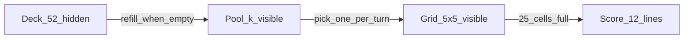
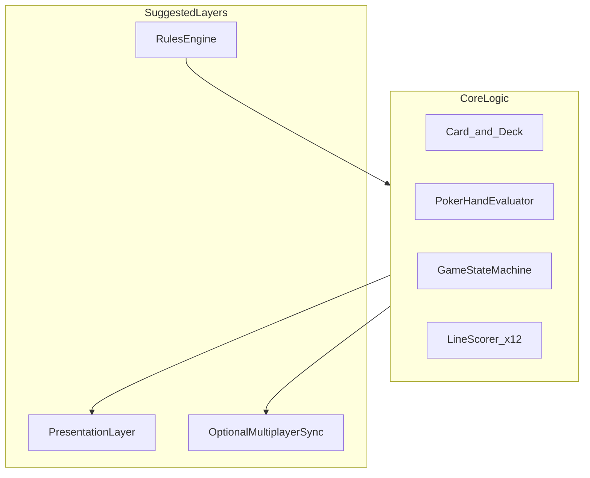

# Quintet Feasibility Analysis Report

## 1. Executive Summary

**Quintet** is a single- and two-player card game that combines a standard 52-card deck with 5×5 adjacency-based placement and Texas Hold'em-style hand scoring. This report evaluates feasibility across rule coherence, balance, two-player fairness, and technical implementation, based on the rules draft in [`prompt.md`](../prompt.md).

**Overall conclusion: the project is feasible; rules prototype, scoring calibration, and browser PoC are complete.**

| Dimension | Rating | Notes |
|-----------|--------|-------|
| Design feasibility | High | Complete rules, sufficient cards, adjacency constraint causes no rule deadlocks |
| Balance feasibility | Medium | Core mechanics are engaging; scoring coefficients and k need data-driven tuning |
| Technical feasibility | High | No exotic algorithms; clear module boundaries; core logic is low-to-medium complexity |
| Two-player mode | High | Shared Pool creates distinct competition; alternating-first-player mitigates first-move advantage |

**Key strengths:**

- Clear information layers across Deck (hidden), Pool (visible), and Grid (visible)
- 5×5 adjacency placement adds spatial planning on top of 12-line poker scoring
- Shared Pool in two-player mode enables card denial and blocking, distinct from traditional poker or pure placement games

**Primary risks:**

- Scoring weights not yet calibrated via probability simulation
- Two-player mode has high strategic complexity; onboarding curve needs attention
- Several rule details (Ace high/low, tie-breakers) remain undefined

**Recommended path:** rules prototype → Monte Carlo scoring simulation → playtest (k=2/3) → optional online multiplayer.

---

## 2. Game Overview

Source: [`prompt.md`](../prompt.md)

### 2.1 Components

| Component | Description |
|-----------|-------------|
| **Deck** | Shuffled standard 52-card deck (no Jokers), face-down |
| **Pool** | Capacity k (set at 1–5 at game start, fixed thereafter), refilled from Deck, face-up |
| **Grid** | Fixed 5×5 board of 25 cells, face-up |

### 2.2 Solo Mode Flow

1. Set k; draw k cards from the Deck into the Pool
2. Each turn, pick one card from the Pool and place it on the Grid; after the first card, every new card must be adjacent to at least one placed card in one of eight directions (orthogonal or diagonal)
3. When the Pool is empty and the Deck is not, refill the Pool to k cards from the Deck
4. The first card may be placed anywhere; the goal is to fill all 25 cells
5. When full, score 12 five-card lines—5 rows, 5 columns, and 2 diagonals—using Texas Hold'em hand rankings

### 2.3 Two-Player Mode Flow

1. Built on solo rules: both players share one Deck and one Pool, taking turns to pick cards and build separate 5×5 Grids
2. Both Grids are visible to the opponent
3. Recommended match format: two games with alternating first player; higher combined score wins, mitigating first-move advantage

### 2.4 State Flow

In two-player mode, the Pool and Deck are shared; each player maintains an independent Grid and alternates picks from the Pool.

---

## 3. Rules Feasibility

### 3.1 Card Supply

| Mode | Consumption | Remaining | Assessment |
|------|-------------|-----------|------------|
| Solo | 25 / 52 | 27 cards | Comfortable margin |
| Two-player | 50 / 52 | 2 cards | Feasible but tight |

**Solo mode:** Uses half the deck. The refill mechanic (empty Pool → refill to k) triggers multiple times in most games, giving players ample selection windows.

**Two-player mode:** Each player fills 25 cells for 50 total; nearly the entire deck is consumed. Implications:

- Late game leaves 0–2 cards in the Deck, creating resource scarcity suited to competitive pacing
- No risk of running out of cards before both boards are full (50 ≤ 52)
- Future rule extensions (discard, swap) require revisiting card budget

### 3.2 Adjacency Placement Constraint

After the first card, every new card must be adjacent to at least one placed card in one of eight directions (orthogonal or diagonal). Placed cards always form a **single connected region**.

**Claim:** On a 5×5 grid, if the placed region is a non-empty connected subgraph and the board is not full, at least one legal empty cell exists for the next placement.

**Sketch:** The 5×5 grid graph is finite and connected. Any proper connected induced subgraph has a boundary cell adjacent to an empty cell; otherwise the region would be the full grid. Players therefore cannot hit a rule-level softlock where no legal placement exists.

**Strategic mistakes vs. rule deadlocks:** Players may expand poorly, waste high-value cards, or compromise target lines—this is skill depth, not a rules defect. Tutorials and legal-move highlighting can reduce beginner frustration.

**Free first placement:** Allowing any starting cell lets players orient expansion toward target lines (a row, column, or main diagonal)—a sound design choice.

### 3.3 Pool Refill Mechanic

"When Pool is empty and Deck is not → refill to k" is unambiguous. Edge cases:

- Deck has fewer than k cards remaining: add all remaining cards (Pool temporarily below k; should be stated explicitly in final rules)
- Deck is empty: no refill; players consume remaining Pool cards

Recommend adding: "If fewer than k cards remain in the Deck, add all remaining cards to the Pool."

### 3.4 Scoring Lines and Cell Overlap

When the board is full, **12 lines** are scored:

- 5 rows (5 cards each)
- 5 columns (5 cards each)
- 2 diagonals (5 cards each)

Each cell participates in its row and column, and possibly one or both diagonals:

| Cell type | Count | Lines involved |
|-----------|-------|----------------|
| Corners | 4 | 3 (1 row + 1 column + 1 diagonal) |
| Edge (non-corner) | 12 | 2 (1 row + 1 column) |
| Center | 1 | 4 (2 rows + 2 columns + 2 diagonals) |

Center cell `(2,2)` (0-indexed) affects 4 scoring lines—a strategic hub. Corners affect 3 lines. This overlap drives core strategic depth and is fully viable under the rules.

---

## 4. Balance and Probability Analysis

[`prompt.md`](../prompt.md) notes scoring is "to be adjusted based on probability." This section evaluates k, line overlap, and the scoring formulas, and identifies items requiring simulation.

### 4.1 Effect of Pool Capacity k

| k | Choice space | Randomness | Skill weight | Design intent |
|---|--------------|------------|--------------|---------------|
| 1 | No choice | High | Low | Fast pace, beginner-friendly, luck-heavy |
| 2 | Pick 1 of 2 | Low–medium | Medium | Strong default candidate |
| 3 | Pick 1 of 3 | Medium | Medium–high | Strong default candidate |
| 4 | Pick 1 of 4 | Low | High | Competitive, high planning depth |

**Analysis:**

- At k=1, players accept the sole card each turn; strategy focuses on placement, not selection—good for a simplified or mobile fast mode
- Higher k lets players avoid duplicate ranks and chase suits/straights, but increases decision time and analysis paralysis risk
- In two-player mode, higher k amplifies first-move advantage in the shared Pool (see Section 5)

**Recommendation:** Default to k=2 or k=3; compare session length and player satisfaction in playtests.

### 4.2 Line Overlap and Hand Conflicts

Unlike standard Hold'em ("deal 5, score 1 hand"), Quintet uses **one card per cell across multiple lines**. The center cell, for example, belongs to row 3, column 3, and both diagonals simultaneously.

**Effects:**

1. **Hard to dominate multiple lines:** Each card has one rank and one suit; making 4 lines simultaneously strong (full house or better) is extremely difficult
2. **Natural variance reduction:** Lowers the rate of "everything hits big," protecting the scoring table from extreme outliers
3. **Meaningful trade-offs:** Players must balance "maximize one line" vs. "spread value across columns/rows"

This supports scoring design without extra restrictions.

### 4.3 Scoring Formula Assessment

Reproduced from [`prompt.md`](../prompt.md):

| Hand | Formula |
|------|---------|
| Royal flush | 50 + high card rank |
| Straight flush | 30 + high card rank |
| Four of a kind | 24 + quad rank × 2 + kicker rank |
| Full house | 18 + trips rank × 1.5 + pair rank |
| Flush | 14 + sum of five ranks × 0.2 |
| Straight | 12 + high card rank |
| Three of a kind | 8 + trips rank + kicker ranks |
| Two pair | 5 + high pair rank + low pair rank × 0.5 + kicker rank |
| One pair | 2 + pair rank |
| High card | 0 + highest rank |

**Structural assessment:**

- "Base score + rank modifier" mirrors Hold'em hierarchy and is easy to learn
- Royal flush (50+) vs. straight flush (30+) gap is large enough to reward chasing premium lines
- High card still yields 0–14 points (A=14), avoiding many zero-score lines and negative feedback

**Items needing calibration:**

- **Expected total score and variance** across 12 lines are unknown; Monte Carlo simulation needed (random shuffle + legal adjacency fill + greedy/random placement)
- Kicker ranks are per-line concepts within 5 cards—no cross-line conflict under current rules
- Flush formula `sum of ranks × 0.2` may overweight high flushes (many A/K); verify against observed frequency

**Suggested follow-up:** A dedicated `scoring-simulation` script or document reporting mean, standard deviation, and 95th percentile per k, then coefficient adjustments.

### 4.4 Rules to Finalize

| Item | Description | Impact |
|------|-------------|--------|
| A-5 straight (Wheel) | Can Ace count as 1 for A-2-3-4-5? | Straight / straight flush detection |
| Ace high/low | High card of straight flush: Ace as 14 or 1? | Royal flush vs. Wheel boundary |
| Rank values | J/Q/K/A as 11/12/13/14? | Score calculation |
| Tie-break | Equal combined score after two games | Competitive rule completeness |

Finalize these in the official rules doc, aligned with common Hold'em conventions to minimize learning friction.

---

## 5. Two-Player Fairness

### 5.1 Shared Deck and Pool

Both players share the Deck and Pool, alternating picks to fill separate Grids. Assessment:

- **Feasible:** 50 cards required fits within 52
- **Differentiated:** Direct competition—first player can take key Pool cards; second player adapts
- **Information symmetry:** Both Grids visible; Pool face-up; Deck count optionally shown for further symmetry

### 5.2 First-Move Advantage

The first player each turn picks first from k face-up Pool cards. Advantages include:

1. Priority access to cards that complete strong personal lines
2. Can deny cards the opponent clearly needs (blocking), even if locally weak
3. Larger k expands denial and planning space; first-move advantage typically grows with k

[`prompt.md`](../prompt.md) proposes **two games with alternating first player, combined score**—a standard, viable compensation (similar to chess dual-board formats).

**Alternatives if playtests show residual bias:**

- Single-game coin flip + small handicap bonus for second player
- Game 1 random first player; Game 2 first player is Game 1's second player (already covered by dual-game format)
- Cap k at 2 in ranked mode to shrink first-move selection window

### 5.3 Information Play and "Waste" Strategies

Players may take cards low in personal value but critical for the opponent—a natural shared-resource tactic. **Treat as intended design**, not a bug.

If playtests show excessive negative experience:

- Limit blocks per game (not recommended—increases rule complexity)
- Adjust k or refill pacing
- Accept as advanced/meta strategy

### 5.4 Session Length

Two players place 50 cards total (25 each). At k=3 and 15–30 seconds per turn, one game runs roughly 12–25 minutes—appropriate for casual to light-competitive card play. Dual-game format doubles length, suited to session-based matches.

---

## 6. Technical Feasibility (Light)

This section avoids specific framework choices and focuses on complexity and module structure.

### 6.1 Suggested Architecture

### 6.2 Core Modules

| Module | Responsibility | Complexity |
|--------|----------------|------------|
| Card / Deck | 52 cards, shuffle, draw | Low |
| Pool | Capacity k, refill logic | Low |
| Grid | 5×5 state, adjacency check, connectivity | Low |
| HandEvaluator | 5-card Hold'em hand ranking | Low (mature O(1) algorithms) |
| Scorer | Score 12 lines and sum | Low |
| GameState | Turn flow, solo/two-player modes | Medium |
| RulesEngine | Integrate modules; expose legal actions | Medium |

### 6.3 Complexity and Effort

- **Core logic: low-to-medium complexity**—no pathfinding AI or real-time physics; primarily state machine and rule validation
- **Main effort:** UI/UX (Grid interaction, Pool selection, 12-line score display), animation and feedback
- **Online two-player (optional):** State sync and turn locking add significant scope over local pass-and-play
- **Solo AI (optional):** Opponent or hint systems need heuristics/search—a separate extension

### 6.4 Testability

| Test type | Target | Method |
|-----------|--------|--------|
| Unit tests | Hand ranking, adjacency, scoring formulas | Fixed inputs and assertions |
| Property tests | 52 unique cards after shuffle | Random + invariants |
| Simulation tests | Score distribution, k balance | Monte Carlo |
| Integration tests | Full game flow | Scripted turn sequences |

With rules engine separated from presentation, core logic can be fully validated via CLI or test suite without UI.

### 6.5 Platform Independence

Deck, Pool, Grid, and Scorer are pure data and functions with no rendering or network dependencies. The same core can serve web, desktop, or mobile with different presentation layers.

---

## 7. Risks, Open Questions, and Recommendations

### 7.1 Risk Register

| Risk | Level | Mitigation |
|------|-------|------------|
| Uncalibrated scoring makes some hands over/underpowered | Medium | Monte Carlo simulation + iterative tuning |
| New players struggle with adjacency or line overlap | Medium | Tutorial, legal-cell highlight, sample games |
| First-move advantage too large at k=4 | Low–medium | Dual-game alternation; or cap k in ranked mode |
| Undefined rule details cause rework | Medium | Finalize Ace/Wheel/tie-break before heavy implementation |
| Dual-game format too long | Low | Offer single-game casual mode |

### 7.2 Open Questions

1. Ace high/low in straights and whether Wheel is legal
2. Tie-break when combined two-game scores are equal
3. Refill behavior when Deck has fewer than k cards
4. Whether to show remaining Deck count to players
5. Solo mode: AI, hints, or undo support
6. Target session length and default k

### 7.3 Phased Implementation

| Phase | Goal | Deliverable | Status |
|-------|------|-------------|--------|
| **Phase 1** | Validate rule flow | CLI + browser PoC: adjacency + scoring | Done |
| **Phase 2** | Calibrate scoring | Monte Carlo v2 coefficients | Done |
| **Phase 3** | Validate fun factor | Python local two-player | Done |
| **Phase 4** | Browser playability | [`poc/`](../poc/) solo PoC | Done |
| **Phase 5** (optional) | Expand audience | Online multiplayer, ranked, web two-player | TBD |

### 7.4 Delivered (PoC-related)

- Ace / Wheel: aligned with Python (Wheel legal)
- Two-player tie-break: Python only; not in browser yet
- Deck count shown in PoC Stats
- **Undo:** supported in PoC (25 steps)
- Default k: 2 in PoC; selectable 1–5

---

## 8. Conclusion

Quintet combines poker hand recognition, spatial placement planning, and (in two-player mode) shared-resource competition. The rules draft is complete and components are clear; design and technical feasibility are **strong**.

| Dimension | Conclusion |
|-----------|------------|
| Design | **Highly feasible** — card supply fits, adjacency avoids deadlocks, 12-line scoring adds depth |
| Balance | **Moderately feasible** — mechanics hold; scoring and k need empirical validation |
| Technical | **Highly feasible** — straightforward core logic; rules/UI separation recommended |
| Two-player | **Highly feasible** — shared Pool is distinctive; dual-game alternation is acceptable |

**Overall recommendation: prototype milestones complete.** Use the Python reference and browser PoC for playtesting and demos; next steps: web two-player, online play, and detailed score UI.

---

*Based on [`prompt.md`](../prompt.md) v1 draft, report draft-1; PoC completion noted in poc-1.*
