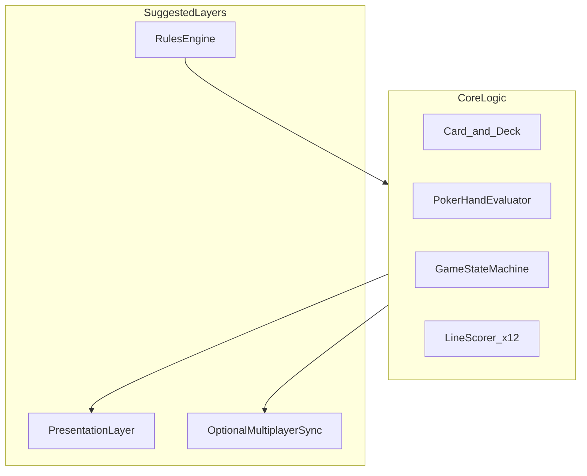

# Quintet 可行性分析报告

## 1. 执行摘要

**Quintet** 是一款将标准 52 张扑克牌与 5×5 邻接放置、德州扑克牌型计分相结合的单/双人卡牌游戏。本报告基于 [`prompt.md`](../prompt.md) 中的规则草案，从规则自洽性、平衡性、双人公平性与技术实现四个维度评估其可行性。

**总体结论：项目整体可行；规则原型、分值校准与浏览器 PoC 均已完成。**

| 维度 | 评估 | 说明 |
|------|------|------|
| 设计可行性 | 高 | 规则完整、牌量匹配、邻接约束不产生规则死锁 |
| 平衡可行性 | 中 | 核心机制有趣，但分值系数与 k 值需数据驱动校准 |
| 技术可行性 | 高 | 无特殊算法依赖，模块边界清晰，核心逻辑复杂度中低 |
| 双人模式 | 高 | 共享牌池博弈差异化明显，换先后手机制可缓解先手优势 |

**核心亮点：**

- 牌堆（Deck）、牌池（Pool）、牌阵（Grid）三区分离，信息层次清晰
- 5×5 邻接放置引入空间规划，与 12 路线扑克计分形成深度策略
- 双人共用牌池创造抢牌与封锁博弈，区别于传统扑克或纯放置类游戏

**主要风险：**

- 分值权重尚未经概率模拟校准
- 双人模式下博弈复杂度较高，新手学习曲线需关注
- 若干规则细节（Ace 高低、平局判定等）待正式定稿

**建议路径：** 规则原型 → 分值 Monte Carlo 模拟 → 可玩性测试（k=2/3）→ 可选在线对战。

---

## 2. 游戏规则摘要

规则来源：[`prompt.md`](../prompt.md)

### 2.1 组件

| 组件 | 说明 |
|------|------|
| **牌堆（Deck）** | 洗混的标准 52 张扑克（无 Joker），暗牌 |
| **牌池（Pool）** | 容量 k（开局设定 1~5，之后不变），从牌堆补充，明牌 |
| **牌阵（Grid）** | 固定 5×5 共 25 个牌位，明牌 |

### 2.2 单人模式流程

1. 设定 k，从牌堆抽 k 张放入牌池
2. 每回合从牌池选一张牌放入牌阵；除首张外，新牌必须与已有牌在上下左右或对角方向相邻（共 8 方向）
3. 牌池清空且牌堆非空时，从牌堆补至 k 张
4. 首张可放任意位置，目标填满 25 格
5. 满盘后对 5 行、5 列、2 条对角线共 12 路牌型计分（德州扑克规则）

### 2.3 双人模式流程

1. 在单人规则基础上，双方共用一牌堆、一牌池，轮流选牌并各自构建 5×5 牌阵
2. 双方牌阵对彼此明牌
3. 建议两局换先后手，以两局总分定胜负，以缓解先手优势

### 2.4 状态流转

双人模式下，Pool 与 Deck 为公共资源；每位玩家拥有独立的 Grid，轮流从 Pool 取牌。

---

## 3. 规则可行性

### 3.1 牌量充足性

| 模式 | 消耗 | 余量 | 评估 |
|------|------|------|------|
| 单人 | 25 / 52 | 27 张 | 充足，牌堆压力小 |
| 双人 | 50 / 52 | 2 张 | 可行但偏紧 |

**单人模式：** 仅使用半副牌，补充机制（池空补至 k）在多数对局中会多次触发，玩家有充分选牌窗口。

**双人模式：** 双方各填 25 格，合计 50 张，整副牌几乎耗尽。这意味着：

- 对局末期牌堆仅剩 0~2 张，资源稀缺感强，符合竞技节奏
- 不存在“牌不够填不满”的问题（50 ≤ 52）
- 若未来扩展规则（如弃牌、换牌），需重新核算牌量边界

### 3.2 邻接放置约束

规则要求：除首张外，每张新牌必须与至少一张已放置牌在上下左右或对角方向相邻（8 连通）。已放置牌始终构成**单一连通区域**。

**命题：** 在 5×5 网格上，若当前已放置区域为非空连通子图，且未满盘，则至少存在一个合法空位可放置下一张牌。

**论证概要：** 5×5 网格图是有限连通图。任意真子集连通诱导子图，其边界上必存在与区域相邻的空格（否则区域为全图）。因此玩家不会因邻接规则本身陷入“无位可放”的规则死锁。

**策略性死锁 vs 规则死锁：** 玩家可能因扩张路径不当而**浪费**高价值牌、或使某条线路难以凑成强牌型——这属于技巧深度，而非规则缺陷。可通过教程或提示系统降低新手挫败感。

**首张自由放置：** 允许任意起点，使玩家可针对目标线路（如某行或主对角线）规划扩张方向，设计合理。

### 3.3 牌池补充机制

“池空且堆非空 → 补至 k”语义明确，无歧义。边界情况：

- 牌堆剩余少于 k：应全部补入，牌池实际容量临时低于 k（需在实现中明确）
- 牌堆已空：不再补充，玩家继续消耗池中剩余牌

建议在正式规则中补充“牌堆不足 k 张时，将全部剩余牌补入牌池”的条款。

### 3.4 计分线路与格子重叠

满盘后计分线路共 **12 条**：

- 5 行（每行 5 张）
- 5 列（每列 5 张）
- 2 条对角线（各 5 张）

同一格子的牌同时参与其所在行、列，以及可能的对角线判定。重叠关系如下：

| 位置类型 | 数量 | 参与线路数 |
|----------|------|------------|
| 四角 | 4 | 3（1 行 + 1 列 + 1 对角） |
| 边中（非角） | 12 | 2（1 行 + 1 列） |
| 中心 | 1 | 4（2 行 + 2 列 + 2 对角） |

中心格 `(2,2)`（0-indexed）同时影响 4 条计分线，是全局策略的枢纽。角格同时影响 3 条线。这种重叠结构是游戏策略深度的核心来源，规则上完全可行。

---

## 4. 平衡性与概率分析

[`prompt.md`](../prompt.md) 标注分值“待根据概率调整”。本章评估 k 值、线路重叠与分值公式的设计合理性，并指出待模拟验证的项。

### 4.1 牌池容量 k 的影响

| k | 选牌空间 | 随机性 | 技能权重 | 设计倾向 |
|---|----------|--------|----------|----------|
| 1 | 无选择 | 高 | 低 | 快节奏、新手友好、偏运气 |
| 2 | 二选一 | 中低 | 中 | 推荐默认值候选 |
| 3 | 三选一 | 中 | 中高 | 推荐默认值候选 |
| 4 | 四选一 | 低 | 高 | 偏竞技、规划深度大 |

**分析：**

- k=1 时，玩家每回合被动接受唯一牌，策略集中在放置位置而非选牌，适合简化版或移动端快节奏模式
- k 越大，玩家越能主动规避重复点数、凑花色/顺子，但也会增加决策时间与分析 paralysis 风险
- 双人模式下 k 越大，先手从池中优先选牌的收益越高（见第 5 章）

**建议：** 默认 k=2 或 k=3，并在 playtest 中对比单局时长与玩家满意度。

### 4.2 线路重叠与牌型冲突

与标准德州扑克“发 5 张评 1 手”不同，Quintet 中**同一格子同时服务多条线路**。例如：中心格既属于横向第 3 行，又属于纵向第 3 列及两条对角线。

**影响：**

1. **多线同强难度高：** 一张牌只能有一个点数和一个花色，极难令 4 条线路同时达成葫芦以上牌型
2. **天然降方差：** 降低了“全盘高牌型”的出现率，避免分值表被极端高分击穿
3. **策略取舍：** 玩家必须在“做强一行”与“兼顾多列”之间权衡，产生有意义的决策

此机制有利于分值表设计，无需额外限制规则。

### 4.3 分值公式初步评估

以下为 [`prompt.md`](../prompt.md) 原文收录：

| 牌型 | 公式 |
|------|------|
| 皇家同花顺 | 50 + 最大牌点 |
| 同花顺 | 30 + 最大牌点 |
| 四条 | 24 + 四条牌点 × 2 + 踢脚牌点 |
| 葫芦 | 18 + 三条牌点 × 1.5 + 一对牌点 |
| 同花 | 14 + 五张牌点之和 × 0.2 |
| 顺子 | 12 + 最大牌点 |
| 三条 | 8 + 三条牌点 + 踢脚牌点 |
| 两对 | 5 + 高对牌点 + 低对牌点 × 0.5 + 踢脚牌点 |
| 一对 | 2 + 对子牌点 |
| 高牌 | 0 + 最高牌点 |

**结构评价：**

- 采用“基础分 + 牌点微调”模式，层级与德州扑克一致，易于理解
- 皇家同花顺（50+）与同花顺（30+）差距足够，鼓励玩家追求极限线路
- 高牌仍有 0~14 分（A=14），避免大量“零分线路”带来的负反馈

**待校准项：**

- 12 路独立计分后，**总分期望值与方差**未知；需 Monte Carlo 模拟（随机洗牌 + 合法邻接填充 + 贪心/随机放置）估算
- “踢脚牌点”在多条线路中是否重复计入同一格子的牌——当前规则下每线独立 5 张，踢脚为线内概念，无冲突
- 同花公式中 `五张牌点之和 × 0.2` 可能使高同花（多 A/K）显著优于低同花，需验证是否与概率匹配

**建议后续产出：** 独立的 `scoring-simulation` 脚本或文档，输出各 k 值下 12 路分的均值、标准差、95 分位数，并据此调整系数。

### 4.4 待明确规则点

| 项 | 说明 | 影响 |
|----|------|------|
| A-5 顺子（Wheel） | Ace 可否作 1 组成 A-2-3-4-5 | 顺子/同花顺判定 |
| Ace 高低 | 同花顺最大牌点：A 作 14 还是 1 | 皇家同花顺与 Wheel 边界 |
| 牌点数值 | J/Q/K/A 是否分别为 11/12/13/14 | 分值公式计算 |
| 同分 tie-break | 双人两局后总分相同 | 竞技规则完整性 |

建议在正式规则文档中一次性定稿，并与德州扑克惯例保持一致以降低学习成本。

---

## 5. 双人模式公平性

### 5.1 共用牌堆与牌池

双方共享 Deck 与 Pool，轮流取牌、各自填充 Grid。此设计：

- **可行：** 50 张牌需求在 52 张供给内
- **差异化：** 引入直接竞争——先手可取走池中关键牌，后手需调整策略
- **信息对称：** 双方 Grid 互明，Pool 明牌，Deck 仅余量未知（若显示剩余张数则进一步对称）

### 5.2 先手优势分析

先手在每轮选牌中优先从 k 张明牌中选取，优势包括：

1. 优先拿走能完成己方强线的牌
2. 可“拿走”对方明显需要的牌（封锁），即使对自己价值一般
3. k 越大，封锁与规划空间越大，先手优势通常越强

[`prompt.md`](../prompt.md) 建议**两局换先后手、比总分**——这是标准且可行的补偿机制（类似国际象棋双局制）。

**备选方案（若 playtest 仍有偏差）：**

- 单局抽签先手 + 后手 small handicap 加分
- 第一局随机先手，第二局由第一局后手先手（已包含在双局方案中）
- 限制 k=2 在竞技模式以降低先手选牌窗口

### 5.3 信息博弈与“浪费”策略

双人模式下，玩家可能选择对己方价值低、但对对手关键的牌，以削弱对方线路——这是共享资源博弈的自然策略，**应视为设计特性**而非 bug。

若 playtest 表明此类行为过度导致负体验，可考虑：

- 限制每局封锁次数（不推荐，增加规则复杂度）
- 调整 k 或牌池刷新节奏
- 接受为高级/meta 策略

### 5.4 对局长度

双人共 50 次放置（各 25），若 k=3、每轮思考 15~30 秒，单局约 12~25 分钟，符合休闲至轻竞技卡牌时长。双局制总时长翻倍，适合会话型对战。

---

## 6. 轻量技术可行性

本节不涉及具体框架选型，仅评估实现复杂度与模块划分。

### 6.1 建议架构

### 6.2 核心模块

| 模块 | 职责 | 复杂度 |
|------|------|--------|
| Card / Deck | 52 张牌、洗牌、抽牌 | 低 |
| Pool | 容量 k、补充逻辑 | 低 |
| Grid | 5×5 状态、邻接校验、连通性 | 低 |
| HandEvaluator | 5 张牌德州扑克牌型判定 | 低（成熟算法，O(1)） |
| Scorer | 12 路线分别求分并汇总 | 低 |
| GameState | 回合流转、单人/双人模式 | 中 |
| RulesEngine | 整合上述模块，暴露合法动作 | 中 |

### 6.3 复杂度与工作量

- **核心逻辑：中低复杂度**——无 AI 路径搜索、无实时物理；主要逻辑为状态机与规则校验
- **主要工作量：** UI/UX（Grid 交互、Pool 选牌、12 路计分展示）、动画与反馈
- **双人联机（可选）：** 需状态同步与回合锁，工作量显著高于本地双人对战
- **单人 AI（可选）：** 若需对手或提示，涉及启发式搜索，为独立扩展项

### 6.4 可测试性

| 测试类型 | 对象 | 方法 |
|----------|------|------|
| 单元测试 | 牌型判定、邻接规则、计分公式 | 固定输入断言 |
| 属性测试 | 洗牌后 52 张不重复 | 随机 + 不变量 |
| 模拟测试 | 分值分布、k 值平衡 | Monte Carlo |
| 集成测试 | 完整对局流程 | 脚本化回合序列 |

规则引擎与展示层分离后，核心逻辑可在无 UI 环境下通过 CLI 或测试套件完整验证。

### 6.5 平台无关性

Deck / Pool / Grid / Scorer 均为纯数据与纯函数，不依赖渲染或网络。同一核心可复用于 Web、桌面或移动端，仅 Presentation Layer 不同。

---

## 7. 风险、待决事项与建议

### 7.1 风险清单

| 风险 | 等级 | 缓解措施 |
|------|------|----------|
| 分值未校准导致某牌型过强/过弱 | 中 | Monte Carlo 模拟 + 迭代调整 |
| 新手不理解邻接规则或线路重叠 | 中 | 教程、合法位高亮、示例对局 |
| 双人先手优势在 k=4 时过大 | 低~中 | 双局换先；或竞技模式限制 k |
| 规则细节未定导致实现返工 | 中 | 优先定稿 Ace/Wheel/tie-break |
| 双局制时长过长 | 低 | 提供单局休闲模式 |

### 7.2 待决事项

1. Ace 在顺子中的高低及 Wheel 是否合法
2. 双人总分相同时的 tie-break 规则
3. 牌堆剩余不足 k 张时的补充细则
4. 是否向玩家展示牌堆剩余张数
5. 单人模式是否需 AI、提示或撤销
6. 目标单局时长与默认 k 值

### 7.3 分阶段实施建议

| 阶段 | 目标 | 产出 | 状态 |
|------|------|------|------|
| **Phase 1** | 验证规则流程 | CLI + 浏览器 PoC：邻接 + 计分 | ✅ |
| **Phase 2** | 校准分值 | Monte Carlo v2 系数 | ✅ |
| **Phase 3** | 验证 fun factor | Python 本地双人对战 | ✅ |
| **Phase 4** | 浏览器可玩性 | [`poc/`](../poc/) 单人 solo PoC | ✅ |
| **Phase 5**（可选） | 扩展受众 | 在线对战、排位、Web 双人 | 待定 |

### 7.4 已实现（PoC 相关）

- Ace / Wheel：与 Python 一致（Wheel 合法，A 可作 1）
- 双人 tie-break：Python `two_player.resolve_match`；Web 未实现双人
- 牌堆剩余张数：PoC Stats 区展示
- **撤销：** PoC 支持（最多 25 步）
- 默认 k：PoC 默认 2，可选 1–5

---

## 8. 总体结论

Quintet 将扑克牌型识别、空间放置规划与（双人模式下）共享资源博弈结合，规则草案完整、组件清晰，在设计与技术层面均具备**良好的可行性**。

| 维度 | 结论 |
|------|------|
| 设计 | **高可行性** — 牌量匹配、邻接无死锁、12 路计分有深度 |
| 平衡 | **中等可行性** — 机制成立，分值与 k 需数据验证 |
| 技术 | **高可行性** — 核心逻辑 straightforward，适合规则/UI 分离架构 |
| 双人 | **高可行性** — 共享 Pool 有差异化；双局换先手可接受 |

**综合建议：原型阶段目标已达成。** Python 参考实现与浏览器 PoC 可用于 playtest 与演示；下一步为 Web 双人、联机与分项计分 UI。

---

*本报告基于 [`prompt.md`](../prompt.md) v1 草案，版本 draft-1；PoC 完成状态更新 poc-1。*
