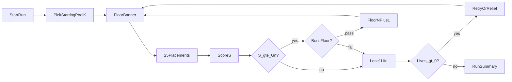
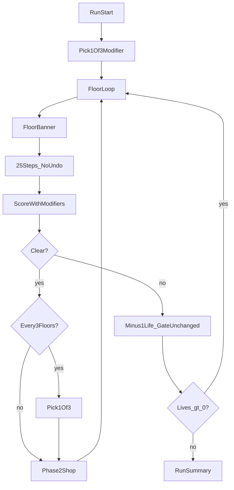
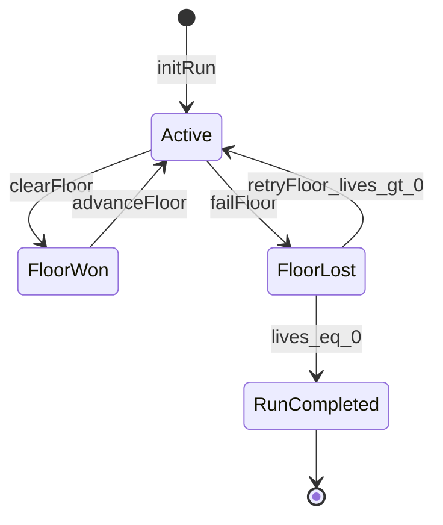
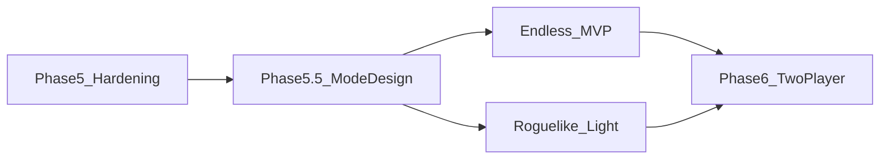

# Quintet Game Modes Design — Endless & Roguelike

> Extends solo play with **Endless mode** (pure continuous challenge) and **Roguelike mode** (in-run build + stricter failure rules).  
> Chinese version: [game-modes-design.zh.md](game-modes-design.zh.md)  
> Rules and scoring baseline: [prompt.md](../prompt.md), [scoring-design.en.md](scoring-design.en.md)

---

## 1. Overview

### 1.1 Background

The browser PoC ([`poc/src/engine/game.ts`](../poc/src/engine/game.ts)) ships **Classic solo**: 25 placements fill a 5×5 grid; 12 lines scored with v4 formulas; no failure state. v4 Monte Carlo (50k random legal fills):

| Metric | Value |
|--------|-------|
| Mean μ | 123.54 |
| Stdev σ | 16.90 |
| 95th percentile | 154.33 |
| Max observed | ~241 |

This design treats **one Quintet board** as a **Floor** atom, chained into a **Run**, without changing core placement rules.

### 1.2 Mode Comparison

| Dimension | Classic | Endless | Roguelike |
|-----------|---------|---------|-----------|
| Run structure | Single board | Multi-board chain | Multi-board chain |
| Build (modifiers) | None | None | Yes (pick 1 of 3, max 5) |
| Shop / meta unlocks | None | None | None in MVP; Phase 2+ |
| Failure | None | Yes (lenient) | Yes (strict) |
| Lives | — | 3 | 2 |
| Undo | Full (25 steps) | 3 per floor | Disabled |
| Primary goal | Single-board high score | Floor count + run total | Floor depth + build synergy |
| Leaderboard | Optional single game | Floor-first | Best floor + seed |

### 1.3 Design Principles

1. **Placement rules unchanged**: first card anywhere, 8-direction adjacency, pool refill, standard 52-card deck (or sub-deck), 12-line v4 scoring.
2. **One board = one Floor**: 25 steps → score → pass/fail → next Floor or run end.
3. **Endless = competitive**: no build; difficulty via gates, deck pressure, bosses.
4. **Roguelike = build-focused**: modifiers reshape feasibility and scoring; Balatro-inspired multipliers without copying its hand-rank system.
5. **Classic stays default**: existing E2E and golden tests unaffected.

---

## 2. Shared Concepts

### 2.1 Floor

One standard Quintet game: empty grid → 25 placements → score `S` on 12 lines.

### 2.2 Score Gate G(n)

Minimum score to clear floor `n` (1-based). Falling short triggers failure (life loss, etc.).

### 2.3 Lives

Run-level tolerance. At zero lives, run ends → Run Summary.

### 2.4 Boss Floor

After a normal fill, an **extra boss objective** must pass. Interval: Endless every 5 floors; Roguelike every 4. Boss type rotates by floor index.

| Boss ID | Name | Clear condition (after fill) |
|---------|------|------------------------------|
| `line_hunter` | Line Hunter | ≥1 complete line ranks Two Pair or better |
| `diagonal_duel` | Diagonal Duel | Both diagonals complete (5/5) |
| `threshold_rush` | Threshold Rush | Total S ≥ G(n) + 20 |
| `sparse_deck` | Sparse Deck | Play on ≤40-card deck and S ≥ G(n) |

**Rotation**: `bossIndex = floor(n / interval) % 4`, cycling the table above.

### 2.5 Deck Pressure DeckConfig

| deckSize | Description | Introduced |
|----------|-------------|------------|
| 52 | Full deck | Default |
| 48 | Shuffle, take first 48 as deck, draw 25 for grid | Endless ≥7; Roguelike ≥5 |
| 45 | Same with 45 cards | Endless ≥10; Roguelike ≥8 |
| 40 | Boss `sparse_deck` only | Boss floors |

Sub-decks must still allow 25 draws; Monte Carlo must verify “legal move always exists.”

### 2.6 Pool k

Visible hand size (1–5). Classic locks k after first placement; in Run modes k may vary per floor via rules or modifiers.

---

## 3. Endless Mode

### 3.1 Positioning

Pure continuous challenge: no modifiers or shop. Primary metric: **highest floor**; secondary: **run total score**.

### 3.2 Run Flow



### 3.3 Single-Floor Flow

1. **Setup**: starting pool k (default 5; standard leaderboard may fix k=3).
2. **Floor n start**: show G(n), lives, boss preview, deckSize / pool adjustments.
3. **Play**: same as Classic; **3 undos per floor**.
4. **Score**: `S` = sum of complete lines (v4).
5. **Gate**:
   - `S ≥ G(n)` → if boss floor, check boss; all pass → floor n+1, `totalScore += S`.
   - Fail → lose 1 life; if lives remain, **one relief retry** with G(n) − 5 (once per floor); further fail → lose life until run ends.

### 3.4 Difficulty Curve

Based on μ≈123.5, σ≈17:

#### Score Gates G(n)

| Floor n | G(n) | Notes |
|---------|------|-------|
| 1 | 100 | Below μ−1.5σ |
| 2 | 110 | |
| 3 | 115 | |
| 4–9 | 115 + (n−4)×2 | 115, 117, …, 125 |
| 10+ | 130 + (n−10)×1.5 | Long-run ramp |

**Boss floors** (5, 10, 15, …): effective gate +5 for boss checks; `S ≥ G(n)` still required first.

#### Pool k and Deck

| Floor n | pool k | deckSize |
|---------|--------|----------|
| 1–6 | starting k (default 5) | 52 |
| 7–9 | max(starting k − 1, 2) | 48 |
| 10–14 | max(starting k − 2, 2) | 45 |
| 15+ | max(starting k − 2, 2) | 45 |

### 3.5 Failure and Lives

| Event | Result |
|-------|--------|
| S < G(n) | −1 life |
| Boss fail | −1 life |
| Lives = 0 | Run over |

Starting lives: **3**.

### 3.6 Leaderboard (local)

`localStorage` key `quintet-endless-best`:

```json
{
  "maxFloor": 12,
  "bestTotalScore": 1580,
  "poolK": 3,
  "achievedAt": "2026-06-29T12:00:00Z"
}
```

Sort: **maxFloor desc**, then **bestTotalScore desc**.

---

## 4. Roguelike Mode

### 4.1 Positioning

**Modifiers** change each floor’s constraints and scoring; stricter failure rules emphasize risk and synergy.

### 4.2 Run Flow



### 4.3 Failure Rules (vs Endless)

| Mechanic | Endless | Roguelike |
|----------|---------|-----------|
| Starting lives | 3 | **2** |
| Gates | Lower (§3.4) | **Start near μ, +4/floor** |
| S < G(n) | −1 life, relief retry | −1 life, **gate unchanged next floor** |
| Boss interval | Every 5 | **Every 4** |
| Boss fail | −1 life | **−2 lives**; `diagonal_duel` **instant death** |
| Undo | 3/floor | **Disabled** |
| Deck pressure | deckSize only | deckSize + modifiers on pool/suits |

#### Roguelike Gates G_R(n)

| Floor n | G_R(n) |
|---------|--------|
| 1 | 118 |
| 2 | 122 |
| 3 | 126 |
| n ≥ 4 | 126 + (n−3)×4 |

### 4.4 Modifier System

**Definition**: passives that alter Quintet variables (pool, gates, line weights)—**not** poker rank tables.

**Acquisition**:

- Run start: pick 1 of 3
- Every 3 cleared floors: pick 1 of 3
- Cap: **5** active; at cap, new pick **replaces** one existing modifier

**Rarity weights** (pick 1 of 3):

| Rarity | Weight | Earliest floor |
|--------|--------|----------------|
| common | 70% | 1 |
| rare | 25% | 3 |
| legendary | 5% | 5 |

### 4.5 MVP Modifier Table

| ID | Name | Rarity | Effect |
|----|------|--------|--------|
| `wide_pool` | Wide Pool | common | pool k +1 (max 5) |
| `narrow_pool` | Narrow Pool | common | pool k −1 (min 2); +3 per complete line |
| `line_boost_row` | Row Boost | common | Random row complete → ×1.5 |
| `line_boost_col` | Column Boost | common | Random col complete → ×1.5 |
| `diag_focus` | Diag Focus | rare | Both diags complete → +15 flat |
| `mulligan` | Mulligan | common | Discard 1 pool card + redraw once per floor |
| `steady_hand` | Steady Hand | rare | Non-boss G(n) −8 |
| `glass_grid` | Glass Grid | legendary | Final S ×1.3; fail costs **+1** life |
| `chip_hoarder` | Chip Hoarder | rare | Score above gate ×1.2 for clear check |
| `sparse_master` | Sparse Master | rare | deck ≤45 → +2 per complete line |
| `heart_line` | Heart Line | common | Main diag complete → ×1.4 |
| `second_wind` | Second Wind | legendary | Once per run, survive at 0 lives |

MVP: **no shop, no meta unlocks**. Negative modifiers not in reward pool except self-risk `glass_grid`.

Full data: [`docs/data/modifiers.mvp.json`](data/modifiers.mvp.json).

### 4.6 Phase 2 — Standard Roguelike

**Chips**: `chips = floor(max(0, S − G_R(n)) × 0.5)` on clear.

**Shop every 3 floors** (skippable): modifiers, consumables (+1 pool next floor), remove modifier, +1 life (cap 3).

**Path choice** after clear: Normal / Elite (G+15, better modifier rarity) / Rest (+1 life, no fight).

### 4.7 Phase 3 — Full Roguelike

- Cross-run meta: unlock modifiers, starter packs, achievements
- Daily seed run leaderboard
- Persistence: `localStorage` `quintet-meta-progress`

---

## 5. State Machine & Engine Interfaces

### 5.1 Conceptual Model

```typescript
type GameMode = "classic" | "endless" | "roguelike";

type RunStatus = "active" | "floor_won" | "floor_lost" | "run_completed";

interface DeckConfig {
  size: 52 | 48 | 45 | 40;
  seed?: number;
}

interface RunState {
  mode: "endless" | "roguelike";
  floor: number;
  lives: number;
  totalScore: number;
  floorTarget: number;
  deckConfig: DeckConfig;
  poolSize: number;
  modifiers: ModifierId[];
  chips?: number;
  bossId?: BossId;
  status: RunStatus;
  currentGame: SoloGameState | null;
  gateReliefUsed?: boolean;
  secondWindUsed?: boolean;
}

interface ModifierDef {
  id: ModifierId;
  name: string;
  description: string;
  rarity: "common" | "rare" | "legendary";
  applySetup?: (state: SoloGameState, ctx: RunContext) => SoloGameState;
  applyScore?: (snapshot: ScoreSnapshot, ctx: RunContext) => ScoreSnapshot;
  onFloorFail?: (run: RunState) => RunState;
}
```

### 5.2 Run State Machine



### 5.3 Engine Extension Points

| Module | Role |
|--------|------|
| [`game.ts`](../poc/src/engine/game.ts) | `createInitialState(poolSize, options?: { deckSize, seed, rng })` |
| `run.ts` (new) | `initRun`, `getFloorTarget`, `checkFloorClear`, `applyModifiers`, `advanceFloor`, `failFloor` |
| `modifiers.ts` (new) | Modifier registry + pure apply functions |
| `bosses.ts` (new) | Boss validation |
| [`gameStore.ts`](../poc/src/store/gameStore.ts) or `runStore.ts` | Classic vs Run branches, undo policy |
| [`simulate.py`](../prototype/quintet/simulate.py) | Gate pass-rate simulation |

### 5.4 Scoring Pipeline

1. Fill complete → `scoreGridComplete` → base snapshot
2. Apply modifiers in order (`applyScore`)
3. Compare `S_final` to G(n) and boss checks

---

## 6. UI / UX Flow

### 6.1 Coexistence with Classic

- Sidebar **Game mode**: `Classic` | `Endless` | `Roguelike`
- Rename Light/Dark **Mode** → **Appearance**
- Classic layout unchanged; Run modes add run info to sidebar/header

### 6.2 Mode Entry — `ModeSelect`

Sidebar dropdown; first Endless/Roguelike visit shows 2-step rules (localStorage flag).

### 6.3 Pre-Floor — `FloorBanner`

Above board before each floor:

```
Floor 7  ·  Target: 121  ·  ♥♥♡ Lives
Deck: 48 cards  ·  Pool k: 4
[Boss] Line Hunter — at least one line ≥ Two Pair
```

Roguelike adds modifier summary line.

### 6.4 Post-Floor — `FloorResultModal`

Replaces auto `GameSummaryModal` in Run modes; Classic keeps original summary.

**Clear**: score vs gate, run total, Continue.  
**Fail**: −1 life, Retry / End run. Endless shows gate-relief retry if unused.

### 6.5 `ModifierDraftModal`

Run start + every 3 cleared floors; 3 cards; replace flow at 5-modifier cap.

### 6.6 `RunSummaryModal`

Max floor, total score, local best, modifier list, New run / Classic.

### 6.7 `ModifierBar`

Roguelike sidebar: up to 5 icons with tooltips.

### 6.8 ASCII Wireframe

```
┌─────────────────────────────────────────────────────────┐
│ Quintet   Floor 7/∞   Target 121   ♥♥♡   Run: 892   Undo 0/3 │
└─────────────────────────────────────────────────────────┘
┌──────────────────────────────────────┬──────────────────┐
│           5×5 Board                  │  Game mode       │
│                                      │  Modifiers (RL)  │
└──────────────────────────────────────┴──────────────────┘
│ Pool tray                                                            │
└──────────────────────────────────────────────────────────────────────┘
```

---

## 7. Balance & Validation

### 7.1 Monte Carlo Plan

Extend [`prototype/quintet/simulate.py`](../prototype/quintet/simulate.py).

**Scan**: deckSize ∈ {52,48,45,40}; pool_k ∈ {2..5}; G from 100–160 step 2; strategies `random_legal`, `greedy_line`.

**10,000 trials** per config → P(S≥G), P(boss|S≥G), E[S], σ[S].

```bash
cd prototype
python -m quintet.simulate --mode run --trials 10000 --gate 121 --deck 48 --pool 3
```

### 7.2 Target Pass Rates

| Floor | Endless P(clear) | Roguelike P(clear) |
|-------|------------------|---------------------|
| 1 | ≥ 92% | ≥ 85% |
| 3 | ≥ 85% | ≥ 75% |
| 5 (Boss) | ≥ 70% | ≥ 55% |
| 10 | ~ 40% | ~ 30% |
| 15 | ~ 15% | ~ 10% |

Adjust G(n) step or deck introduction if simulation deviates ±10%.

### 7.3 Modifier Isolation

Per-modifier Δμ, Δσ; target |Δμ| ≤ 8. Combo cap: `wide_pool + line_boost + glass_grid` → E[S] ≤ 1.4μ.

### 7.4 Playtest Targets

| Metric | Endless | Roguelike |
|--------|---------|-----------|
| Avg run length | 8–15 floors | 5–8 floors |
| Median best | 10 | 6 |
| Session time | 15–40 min | 20–45 min |

### 7.5 Regression

Classic golden scores and E2E unchanged.

---

## 8. Roadmap



| Phase | Deliverable |
|-------|-------------|
| 5.5 | This document |
| 5.6a | Endless: run engine + floor UI + local board |
| 5.6b | Roguelike MVP: modifiers + draft, no shop |
| 5.7 | Phase 2 shop + paths |
| 5.8 | Phase 3 meta + daily seed |

---

## 9. Open Questions (TBD)

| # | Question | Default |
|---|----------|---------|
| 1 | Time limit Endless 10+ | **No** |
| 2 | Negative modifiers in MVP pool | **No** (except `glass_grid`) |
| 3 | Leaderboard scope | **localStorage**; online Phase 7 |
| 4 | Roguelike `diagonal_duel` instant death | Playtest; may become −2 lives |
| 5 | Force k=3 standard board | Separate leaderboard entry only |

---

## Appendix A: Modifier JSON Schema

See [game-modes-design.zh.md § Appendix A](game-modes-design.zh.md) for full schema (language-neutral).

Data: [`docs/data/modifiers.mvp.json`](data/modifiers.mvp.json).

---

## Appendix B: Boss JSON Schema

Data: [`docs/data/bosses.json`](data/bosses.json).

---

## Appendix C: Run Config

Defaults: [`docs/data/run-config.json`](data/run-config.json).
