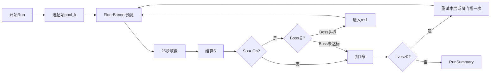
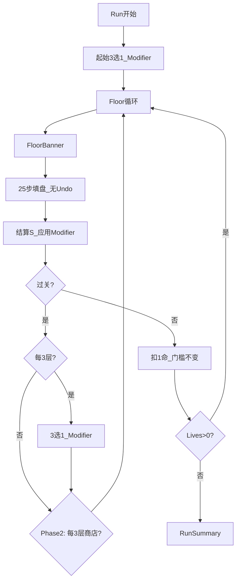
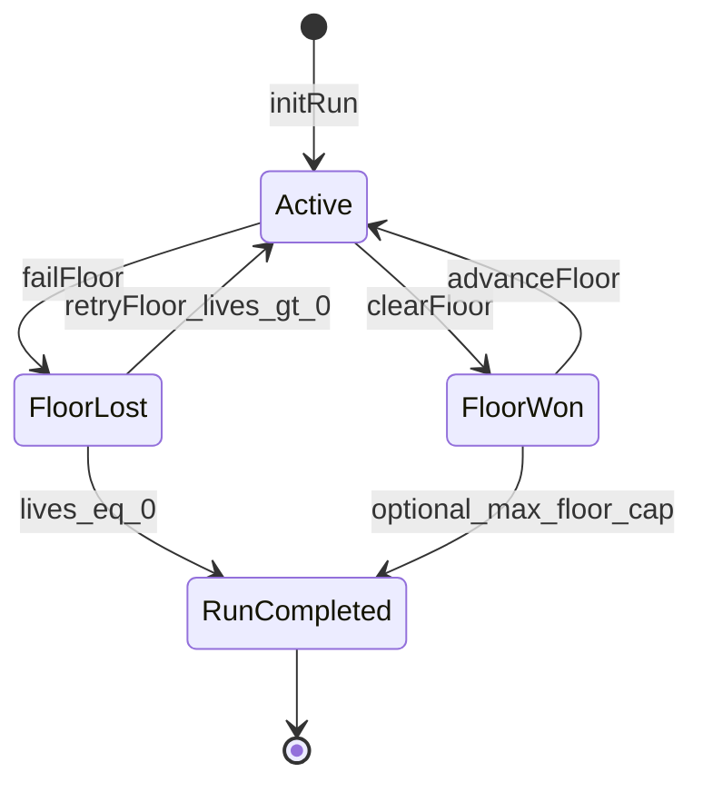
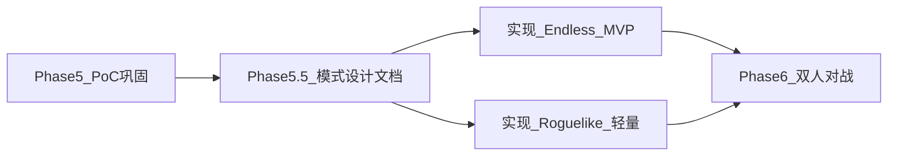

# Quintet 游戏模式设计 — 无尽与 Roguelike

> 为单人模式扩展 **无尽模式**（纯连续挑战）与 **Roguelike 模式**（run 内 build + 更严失败规则）。  
> 英文版：[game-modes-design.en.md](game-modes-design.en.md)  
> 规则与计分基准：[prompt.md](../prompt.md)、[scoring-design.zh.md](scoring-design.zh.md)

---

## 1. 概述

### 1.1 背景

当前浏览器 PoC（[`poc/src/engine/game.ts`](../poc/src/engine/game.ts)）提供 **Classic 单人模式**：固定 25 步填满 5×5 棋盘，对 12 条线按 v4 公式计分，无失败条件。v4 蒙特卡洛（5 万局随机合法填盘）统计：

| 指标 | 数值 |
|------|------|
| 均值 μ | 123.54 |
| 标准差 σ | 16.90 |
| 95 分位 | 154.33 |
| 最大值（观测） | ~241 |

本设计在 **不改动核心放置规则** 的前提下，将「一盘 Quintet」作为 **Floor（层/关）** 原子单位，串联成 **Run**，并新增两种独立玩法。

### 1.2 模式对比

| 维度 | Classic | 无尽 Endless | Roguelike |
|------|---------|--------------|-----------|
| Run 结构 | 单盘 | 多盘连续 | 多盘连续 |
| Build（modifier） | 无 | 无 | 有（3 选 1，上限 5） |
| 商店 / 跨 run 解锁 | 无 | 无 | MVP 无；Phase 2+ 有 |
| 失败条件 | 无 | 有（宽松） | 有（严格） |
| 生命 | — | 3 | 2 |
| Undo | 全量（25 步） | 每盘 3 次 | 禁用 |
| 核心目标 | 单盘高分 | 层数 + run 总分 | 通关层数 + build 协同 |
| 排行榜 | 可选单盘 | 层数优先 | 最高 floor + seed |

### 1.3 核心设计原则

1. **放置规则不变**：首子任意、八向邻接、pool 补牌、52 张标准牌（或子牌堆）、12 线 v4 计分。
2. **一盘 = 一 Floor**：25 步填盘 → 结算 → 判定过关/失败 → 进入下一 Floor 或结束 Run。
3. **无尽 = 竞技向**：无 build，靠门槛、牌库压力、Boss 制造难度曲线。
4. **Roguelike = 构建向**：modifier 改变单盘可行域与分数结构；借鉴 Balatro 的「加成/乘算」爽感，但不复制其牌型体系。
5. **Classic 保持默认**：现有 E2E 与 golden 测试不受影响。

---

## 2. 共用概念

### 2.1 Floor（层）

一次标准 Quintet 对局：从空盘开始，25 次放置填满 5×5，结算 12 线得分 `S`。

### 2.2 分数门槛 G(n)

第 `n` 层（n 从 1 起）的最低过关分数。未达标触发失败流程（扣命等）。公式见各模式章节。

### 2.3 生命 Lives

Run 内的「容错次数」。命尽则 Run 结束，进入 Run Summary。

### 2.4 Boss Floor

在普通 Floor 规则之上，填盘完成后需 **额外满足 Boss 目标**。Boss 出现在固定间隔（无尽每 5 层，Roguelike 每 4 层），类型按 floor 轮换。

| Boss ID | 名称 | 过关条件（填盘完成后） |
|---------|------|------------------------|
| `line_hunter` | 线猎 | 至少 1 条 complete 线的牌型 ≥ Two Pair |
| `diagonal_duel` | 对角决斗 | 两条对角线均 complete（5/5） |
| `threshold_rush` | 门槛冲刺 | 总分 S ≥ G(n) + 20 |
| `sparse_deck` | 稀疏牌库 | 本盘使用 ≤40 张子牌堆，且 S ≥ G(n) |

**Boss 轮换**：`bossIndex = floor(n / interval) % 4`，按上表顺序循环。

### 2.5 牌库压力 DeckConfig

| deckSize | 说明 | 引入 floor |
|----------|------|------------|
| 52 | 标准全牌堆 | 默认 |
| 48 | 洗牌后取前 48 张作为本盘牌堆，再抽 25 张填盘 | 无尽 ≥7；Roguelike ≥5 |
| 45 | 同上，45 张 | 无尽 ≥10；Roguelike ≥8 |
| 40 | Boss `sparse_deck` 专用 | Boss 关指定 |

子牌堆仍保证 25 张可抽满；实现时需蒙特卡洛验证「合法步始终存在」不变量。

### 2.6 Pool k

可见手牌数（1–5）。Classic 在首子前选定并锁定；Run 模式中 **每层可因 floor 规则或 modifier 变化**，在 `createInitialState` 时确定本层 k。

---

## 3. 无尽模式（Endless）

### 3.1 定位

纯连续挑战：无 modifier、无商店。玩家追求 **最高到达层数**（主）与 **Run 累计总分**（次）。

### 3.2 Run 流程



### 3.3 单盘流程

1. **Setup**：选择起始 pool k（默认 5；标准挑战榜固定 k=3）。
2. **Floor n 开始**：显示 `G(n)`、生命、Boss 预告（若有）、本层 deckSize / pool 修正。
3. **Play**：与 Classic 相同放置规则；Undo 限制 **每盘 3 次**。
4. **结算**：计算 `S`（v4，12 线 complete 线之和）。
5. **门槛判定**：
   - `S ≥ G(n)` → 若 Boss 关，再检 Boss 目标；全部通过 → Floor n+1，`totalScore += S`。
   - 未通过 → 扣 1 命；若仍有命，**可重试同一关一次且 G(n) 降 5**（每关仅一次降门槛救济）；再失败则扣命直至结束。

### 3.4 难度曲线

基于 μ≈123.5、σ≈17：

#### 分数门槛 G(n)

| Floor n | G(n) | 备注 |
|---------|------|------|
| 1 | 100 | 低于 μ−1.5σ，入门 |
| 2 | 110 | |
| 3 | 115 | |
| 4–9 | 115 + (n−4)×2 | 即 115, 117, 119, 121, 123, 125 |
| 10+ | 130 + (n−10)×1.5 | 长线加压 |

**Boss 关**（n = 5, 10, 15, …）：有效门槛视为 `G(n) + 5`（用于 `threshold_rush` 等），但 `S ≥ G(n)` 仍为前置条件。

#### Pool k 与牌库

| Floor n | pool k | deckSize |
|---------|--------|----------|
| 1–6 | 起始 k（默认 5） | 52 |
| 7–9 | max(起始 k − 1, 2) | 48 |
| 10–14 | max(起始 k − 2, 2) | 45 |
| 15+ | max(起始 k − 2, 2) | 45 |

每 3 关 pool k 额外 −1 的规则已并入上表阶梯，下限为 2。

### 3.5 失败与生命

| 事件 | 后果 |
|------|------|
| S < G(n) | 扣 1 命 |
| Boss 目标未达成 | 扣 1 命 |
| 命尽 | Run 结束 |

起始生命：**3**。

### 3.6 排行榜（本地）

`localStorage` 键 `quintet-endless-best`：

```json
{
  "maxFloor": 12,
  "bestTotalScore": 1580,
  "poolK": 3,
  "achievedAt": "2026-06-29T12:00:00Z"
}
```

排序：**maxFloor 降序**，同层 **bestTotalScore 降序**。

---

## 4. Roguelike 模式

### 4.1 定位

Run 内通过 **Modifier（修饰符）** 构建不同策略；失败规则更严，强调风险与协同。

### 4.2 Run 流程



### 4.3 失败规则（与无尽对比）

| 机制 | 无尽 | Roguelike |
|------|------|-----------|
| 起始生命 | 3 | **2** |
| 分数门槛 | 偏低（见 §3.4） | **μ 附近起，每关 +4** |
| S < G(n) | 扣 1 命，可降门槛重试 | 扣 1 命，**下一层 G 不变** |
| Boss 间隔 | 每 5 层 | **每 4 层** |
| Boss 失败 | 扣 1 命 | **扣 2 命**；`diagonal_duel` 失败 **即死** |
| Undo | 每盘 3 次 | **禁用** |
| 牌库 | 仅 deckSize | deckSize + modifier 可改 pool / 花色 |

#### Roguelike 门槛 G_R(n)

| Floor n | G_R(n) |
|---------|--------|
| 1 | 118 |
| 2 | 122 |
| 3 | 126 |
| n ≥ 4 | 126 + (n−3)×4 |

### 4.4 Modifier 系统

**定义**：改变 Quintet 局内变量（pool、门槛、计分线权重等）的被动件，**不修改 poker 牌型等级表**。

**获取**：

- Run 开始：3 选 1
- 每通过 3 层：3 选 1
- 上限：**5** 个并存；已满时新奖励改为「替换任一已有 modifier」

**稀有度权重**（3 选 1 抽卡）：

| 稀有度 | 权重 | 最早出现 floor |
|--------|------|----------------|
| common | 70% | 1 |
| rare | 25% | 3 |
| legendary | 5% | 5 |

### 4.5 MVP Modifier 全表

| ID | 名称 | 稀有度 | 效果 |
|----|------|--------|------|
| `wide_pool` | 广池 | common | pool k +1（上限 5） |
| `narrow_pool` | 窄池 | common | pool k −1（下限 2）；每 complete 线 +3 分 |
| `line_boost_row` | 行赏 | common | 随机一行 complete 时该线 ×1.5 |
| `line_boost_col` | 列赏 | common | 随机一列 complete 时该线 ×1.5 |
| `diag_focus` | 对角心 | rare | 两条对角均 complete 时 +15 flat |
| `mulligan` | 换牌 | common | 每盘开始前可弃 1 张 pool 牌并补 1 张（一次性 UI 操作） |
| `steady_hand` | 稳手 | rare | 非 Boss 关 G(n) −8 |
| `glass_grid` | 玻璃盘 | legendary | 本盘最终 S ×1.3；若未过关扣 **2** 命 |
| `chip_hoarder` | 囤分 | rare | 超过 G(n) 的部分 ×1.2 计入 S（仅过关判定与展示） |
| `sparse_master` | 稀疏大师 | rare | deckSize ≤45 时所有 complete 线 +2 分 |
| `heart_line` | 心线 | common | 主对角 complete 时 ×1.4 |
| `second_wind` | 续命 | legendary | 首次命尽时保留 1 命（每 run 一次） |

MVP **不含商店、不含跨 run 解锁**。负面 modifier 不进奖励池；`glass_grid` 为自损型 legend。

### 4.6 Phase 2 — 标准 Roguelike

**Chips 经济**：

- 过关后获得 `chips = floor(max(0, S − G_R(n)) × 0.5)`
- 每 3 层进入 **商店**（可跳过）

**商店货品示例**：

| 类型 | 价格 | 说明 |
|------|------|------|
| 随机 common modifier | 15 | 新 modifier 或替换 |
| 随机 rare modifier | 35 | |
| Consumable「下盘 +1 pool」 | 10 | 一次性 |
| 移除 modifier | 20 | 腾槽位 |
| +1 生命 | 40 | 上限 3 |

**路线选择**（过关后二选一，Phase 2）：

| 路线 | 效果 |
|------|------|
| Normal | 标准下一层 |
| Elite | G +15，modifier 奖励稀有度提升一档 |
| Rest | 不战斗，+1 命，无分数 |

### 4.7 Phase 3 — 完整 Roguelike

- **跨 run meta**：成就解锁新 modifier 入池、起始 modifier 包、额外生命上限
- **每日 Seed Run**：固定 seed，本地/在线排行榜
- 持久化：`localStorage` 键 `quintet-meta-progress`

---

## 5. 状态机与引擎接口

### 5.1 概念模型

```typescript
type GameMode = "classic" | "endless" | "roguelike";

type RunStatus = "active" | "floor_won" | "floor_lost" | "run_completed";

interface DeckConfig {
  size: 52 | 48 | 45 | 40;
  seed?: number;
}

interface RunState {
  mode: "endless" | "roguelike";
  floor: number;
  lives: number;
  totalScore: number;
  floorTarget: number;
  deckConfig: DeckConfig;
  poolSize: number;
  modifiers: ModifierId[];
  chips?: number;
  bossId?: BossId;
  status: RunStatus;
  currentGame: SoloGameState | null;
  /** 无尽：本层是否已用过降门槛救济 */
  gateReliefUsed?: boolean;
  /** Roguelike：second_wind 是否已触发 */
  secondWindUsed?: boolean;
}

interface ModifierDef {
  id: ModifierId;
  name: string;
  description: string;
  rarity: "common" | "rare" | "legendary";
  applySetup?: (state: SoloGameState, ctx: RunContext) => SoloGameState;
  applyScore?: (snapshot: ScoreSnapshot, ctx: RunContext) => ScoreSnapshot;
  onFloorFail?: (run: RunState) => RunState;
}
```

### 5.2 Run 状态机



### 5.3 引擎扩展点（实现阶段）

| 模块 | 职责 |
|------|------|
| [`game.ts`](../poc/src/engine/game.ts) | `createInitialState(poolSize, options?: { deckSize, seed, rng })` |
| `run.ts`（新） | `initRun`, `getFloorTarget`, `checkFloorClear`, `applyModifiers`, `advanceFloor`, `failFloor` |
| `modifiers.ts`（新） | Modifier 注册表与纯函数应用 |
| `bosses.ts`（新） | Boss 条件校验 |
| [`gameStore.ts`](../poc/src/store/gameStore.ts) 或 `runStore.ts` | Classic / Run 分支、Undo 策略 |
| [`simulate.py`](../prototype/quintet/simulate.py) | 扩展：带门槛的通过率模拟 |

### 5.4 计分管道

1. 填盘结束 → `scoreGridComplete` → 基础 `ScoreSnapshot`
2. 按 modifier 顺序调用 `applyScore`（如行赏 ×1.5、对角 +15）
3. 得到 `S_final` 与 `G(n)` / Boss 条件比较

---

## 6. UI / UX 流程

### 6.1 与 Classic 并存

- 侧边栏 **Game mode** 下拉：`Classic` | `Endless` | `Roguelike`
- 现有 **Mode**（Light/Dark）重命名为 **Appearance**，避免歧义
- Classic 行为与布局 **完全不变**；选 Endless/Roguelike 时侧边栏与顶栏增加 Run 信息

### 6.2 模式入口 — `ModeSelect`

**位置**：侧边栏「Game mode」切换；首次选 Endless/Roguelike 时弹出简要规则（2 步，localStorage 标记已读）。

**Endless 首访 copy**：

1. 连续多盘 Quintet，每盘需达到分数门槛。
2. 3 条命；Boss 每 5 层；层数越高难度越大。

**Roguelike 首访 copy**：

1. 带 Modifier build；无 Undo；2 条命。
2. 每 3 层 3 选 1；Boss 更危险。

### 6.3 关前 — `FloorBanner`

**触发**：每层开始前，棋盘上方横幅（可 dismiss）。

**内容**：

```
Floor 7  ·  Target: 121  ·  ♥♥♡ Lives
Deck: 48 cards  ·  Pool k: 4
[Boss] Line Hunter — 至少一条线 ≥ Two Pair
```

Roguelike 额外一行：`Modifiers: 广池 · 行赏 · 稳手`

### 6.4 关后 — `FloorResultModal`

**触发**：25 步填盘结束，替代 Classic 的自动 `GameSummaryModal`（Run 模式）；Classic 仍用原 Summary。

**达标态**：

```
Floor 7 cleared!     128 / 121
+7 over target
Total run score: 892
[ Continue to Floor 8 ]
```

**失败态**：

```
Floor 7 failed       115 / 121
−1 Life  (♥♡♡ remaining)
[ Retry floor ]  [ End run ]
```

无尽：显示「降门槛重试」按钮（若本层未用过 relief）。Roguelike：无降门槛，仅重试或结束。

### 6.5 Modifier — `ModifierDraftModal`

**触发**：Run 开始、每 3 层过关后。

**布局**：三列卡片，每张含名称、稀有度色、效果说明；点击即选。

**已满 5 个**：先选要替换的旧 modifier，再选新 modifier。

### 6.6 Run 结束 — `RunSummaryModal`

```
Run over — Floor 12
Total score: 1,542
Best floor (local): 12
Modifiers: …
[ New run ]  [ Classic mode ]
```

### 6.7 常驻组件 — `ModifierBar`

Roguelike 侧边栏：图标 +  tooltip 列表，最多 5 个。

### 6.8 线框示意（ASCII）

**Run 进行中顶栏**：

```
┌─────────────────────────────────────────────────────────┐
│ Quintet   Floor 7/∞   Target 121   ♥♥♡   Run: 892   Undo 0/3 │
└─────────────────────────────────────────────────────────┘
┌──────────────────────────────────────┬──────────────────┐
│           5×5 Board                  │  Game mode       │
│                                      │  Pool k / Theme  │
│                                      │  ─────────────   │
│                                      │  Modifiers (RL)  │
│                                      │  Lines 8/12      │
└──────────────────────────────────────┴──────────────────┘
│ Pool tray                                                            │
└──────────────────────────────────────────────────────────────────────┘
```

---

## 7. 平衡与验证

### 7.1 蒙特卡洛方案

**工具**：扩展 [`prototype/quintet/simulate.py`](../prototype/quintet/simulate.py)。

**参数扫描**：

- `deckSize` ∈ {52, 48, 45, 40}
- `pool_k` ∈ {2, 3, 4, 5}
- `G` 从 100 到 160，步长 2
- 策略：`random_legal`（基线）、`greedy_line`（贪心补最强线）

**每配置 10,000 局**，输出：

- `P(S ≥ G)`：分数门槛通过率
- `P(boss | S ≥ G)`：条件 Boss 通过率
- `E[S]`, `σ[S]`

**命令草案**：

```bash
cd prototype
python -m quintet.simulate --mode run --trials 10000 --gate 121 --deck 48 --pool 3
```

### 7.2 目标通过率曲线

| Floor | 无尽 P(clear) | Roguelike P(clear) | 说明 |
|-------|---------------|---------------------|------|
| 1 | ≥ 92% | ≥ 85% | 教学层 |
| 3 | ≥ 85% | ≥ 75% | |
| 5 (Boss) | ≥ 70% | ≥ 55% | |
| 10 | ~ 40% | ~ 30% | 中期挑战 |
| 15 | ~ 15% | ~ 10% | 高分段 |

若实模拟偏离 ±10%，调整 `G(n)` 步长或 deck 引入 floor，**不改核心规则**。

### 7.3 Modifier 隔离测试

每个 modifier 单独挂载，测 `Δμ`、`Δσ`；目标单件 `|Δμ| ≤ 8`。组合测试：`wide_pool + line_boost + glass_grid` 上限 `E[S] ≤ 1.4μ`。

### 7.4 Playtest 指标

| 指标 | 无尽目标 | Roguelike 目标 |
|------|----------|----------------|
| 平均 run 层数 | 8–15 | 5–8 |
| 中位最高层 | 10 | 6 |
| 单 run 时长 | 15–40 min | 20–45 min |

### 7.5 回归

Classic 模式 golden scores（[`fixtures/golden-scores.json`](../fixtures/golden-scores.json)）与 E2E（[`poc/e2e/solo.spec.ts`](../poc/e2e/solo.spec.ts)）**零变更**。

---

## 8. 路线图



| 阶段 | 交付 |
|------|------|
| Phase 5.5 | 本文档 |
| Phase 5.6a | Endless：Run 引擎 + Floor UI + 本地榜 |
| Phase 5.6b | Roguelike MVP：Modifier 池 + Draft + 无商店 |
| Phase 5.7 | Phase 2 商店与路线 |
| Phase 5.8 | Phase 3 meta + 每日 seed |

---

## 9. 开放问题（TBD）

| # | 问题 | 当前默认 |
|---|------|----------|
| 1 | 无尽 Floor 10+ 是否加时间限制 | **否** |
| 2 | MVP 是否允许负面 modifier 进池 | **否**（仅 `glass_grid` 自损 legend） |
| 3 | 排行榜范围 | **localStorage**；在线 Phase 7 |
| 4 | `diagonal_duel` Roguelike 即死是否过苛 | 待 playtest；可改为扣 2 命 |
| 5 | 无尽 k=3 标准榜是否强制 | 建议独立榜条目，不强制 |

---

## 附录 A：Modifier JSON Schema

```json
{
  "$schema": "https://json-schema.org/draft/2020-12/schema",
  "$id": "https://quintet.dev/schemas/modifier.json",
  "title": "QuintetModifier",
  "type": "object",
  "required": ["id", "name", "description", "rarity", "effects"],
  "properties": {
    "id": {
      "type": "string",
      "pattern": "^[a-z][a-z0-9_]*$"
    },
    "name": { "type": "string" },
    "description": { "type": "string" },
    "rarity": {
      "enum": ["common", "rare", "legendary"]
    },
    "maxStacks": {
      "type": "integer",
      "minimum": 1,
      "default": 1
    },
    "effects": {
      "type": "array",
      "items": { "$ref": "#/$defs/ModifierEffect" }
    },
    "tags": {
      "type": "array",
      "items": { "type": "string" }
    }
  },
  "$defs": {
    "ModifierEffect": {
      "type": "object",
      "required": ["type"],
      "properties": {
        "type": {
          "enum": [
            "pool_delta",
            "gate_delta",
            "line_multiplier",
            "line_flat_bonus",
            "diag_bonus",
            "score_multiplier",
            "mulligan",
            "fail_life_delta",
            "second_wind",
            "over_gate_multiplier"
          ]
        },
        "value": { "type": "number" },
        "lineSelector": {
          "enum": ["random_row", "random_col", "main_diag", "anti_diag", "both_diags", "all"]
        },
        "conditions": {
          "type": "object",
          "properties": {
            "maxDeckSize": { "type": "integer" },
            "bossFloor": { "type": "boolean" },
            "nonBossFloor": { "type": "boolean" }
          }
        }
      }
    }
  }
}
```

### MVP Modifier 数据文件示例

见 [`docs/data/modifiers.mvp.json`](data/modifiers.mvp.json)。

---

## 附录 B：Boss JSON Schema

```json
{
  "$schema": "https://json-schema.org/draft/2020-12/schema",
  "$id": "https://quintet.dev/schemas/boss.json",
  "title": "QuintetBoss",
  "type": "object",
  "required": ["id", "name", "description", "check"],
  "properties": {
    "id": { "type": "string" },
    "name": { "type": "string" },
    "description": { "type": "string" },
    "check": { "$ref": "#/$defs/BossCheck" },
    "penalty": {
      "type": "object",
      "properties": {
        "endless": { "$ref": "#/$defs/Penalty" },
        "roguelike": { "$ref": "#/$defs/Penalty" }
      }
    }
  },
  "$defs": {
    "BossCheck": {
      "type": "object",
      "required": ["type"],
      "properties": {
        "type": {
          "enum": [
            "min_hand_on_any_line",
            "both_diagonals_complete",
            "score_at_least_gate_plus",
            "sparse_deck_score"
          ]
        },
        "minHandCategory": { "type": "string" },
        "gateBonus": { "type": "number" },
        "maxDeckSize": { "type": "integer" }
      }
    },
    "Penalty": {
      "type": "object",
      "properties": {
        "lifeDelta": { "type": "integer" },
        "instantDeath": { "type": "boolean" }
      }
    }
  }
}
```

### Boss 数据文件

见 [`docs/data/bosses.json`](data/bosses.json)。

---

## 附录 C：Run 配置 JSON Schema

```json
{
  "$schema": "https://json-schema.org/draft/2020-12/schema",
  "$id": "https://quintet.dev/schemas/run-config.json",
  "title": "QuintetRunConfig",
  "type": "object",
  "required": ["mode"],
  "properties": {
    "mode": { "enum": ["endless", "roguelike"] },
    "startingLives": { "type": "integer" },
    "startingPoolK": { "type": "integer", "minimum": 1, "maximum": 5 },
    "bossInterval": { "type": "integer" },
    "gateFormula": {
      "type": "object",
      "properties": {
        "type": { "enum": ["endless", "roguelike"] }
      }
    },
    "undoPerFloor": { "type": "integer", "nullable": true },
    "maxModifiers": { "type": "integer" }
  }
}
```

默认配置见 [`docs/data/run-config.json`](data/run-config.json)。
