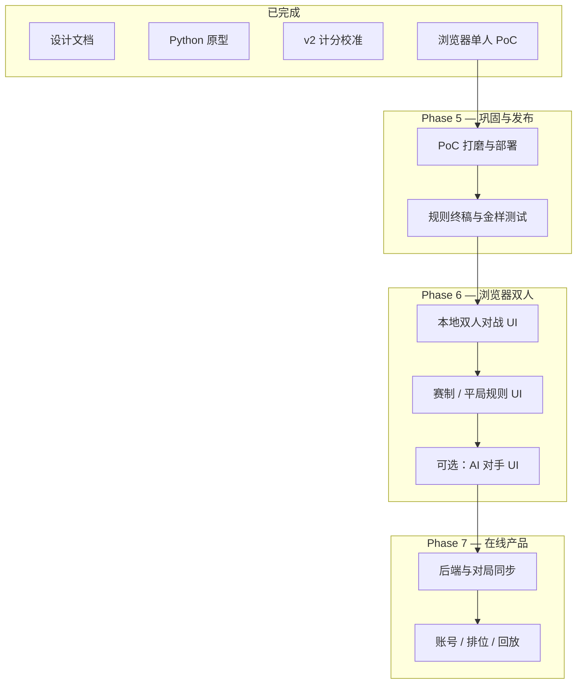

# Quintet 项目进展总结与演进规划

> 本文档汇总截至 **2026-06-29** 已完成的开发内容，并给出后续演进方向与下一步开发计划。  
> 英文版：[project-status.en.md](project-status.en.md)

---

## 1. 项目概览

**Quintet** 是一款 5×5 扑克网格游戏：从牌池选牌放入棋盘，遵守八方向邻接规则（含对角），对 12 条线（5 行、5 列、2 对角线）按德州扑克牌型计分。

| 维度 | 结论 |
|------|------|
| 设计可行性 | 高 — 规则闭环，52 张牌刚好填满棋盘 |
| 技术可行性 | 高 — 核心为状态机 + 牌型判定，无复杂算法 |
| 当前阶段 | **浏览器单人 PoC 已完成并可玩** |
| 参考实现 | Python CLI（规则引擎、模拟、本地双人对战） |

---

## 2. 已完成内容总览

### 2.1 阶段对照表

| 阶段 | 目标 | 交付物 | 状态 |
|------|------|--------|------|
| **设计** | 规则梳理、可行性、计分方案 | [`docs/`](../docs/)、[`prompt.md`](../prompt.md) | ✅ 完成 |
| **Phase 1** | 验证规则流程 | Python 规则引擎 + CLI 单人模式 | ✅ 完成 |
| **Phase 2** | 计分校准 | v2 系数（5 万局蒙特卡洛） | ✅ 完成 |
| **Phase 3** | 双人可玩性 | Python 本地对战、赛制、贪心 AI、模拟 | ✅ 完成 |
| **Phase 4** | 浏览器可玩性 | React 单人 PoC | ✅ 完成 |
| **Phase 5+** | 产品化扩展 | 浏览器双人、在线、排位等 | 📋 规划中 |

### 2.2 文档交付

| 文档 | 说明 |
|------|------|
| [可行性分析](feasibility-analysis.zh.md) | 规则、平衡、技术、双人模式评估 |
| [计分设计 v2](scoring-design.zh.md) | 系数推导、模拟数据、牌型分值 |
| [Web PoC 技术设计](technical-design.zh.md) | 技术选型、架构、实现阶段 |
| [游戏规则草案](../prompt.md) | 原始规则描述 |

### 2.3 Python 原型（`prototype/`）

| 模块 | 能力 |
|------|------|
| 核心引擎 | 牌/牌堆、5×5 网格、邻接、12 线牌型判定、v2 计分 |
| CLI | `solo` / `versus` / `match` 三种模式 |
| 双人赛制 | 两局交替先手；总分 → 单局最高 → 优质线数量 → 平局 |
| AI | 贪心 bot（`ai` 命令） |
| 模拟 | 随机 / 贪心策略、蒙特卡洛计分对比 |
| 测试 | `pytest` 单元测试 |

```bash
cd prototype && pip install -e .
python -m quintet.cli --mode solo
python -m quintet.simulate --compare -n 50000
```

### 2.4 浏览器 PoC（`poc/`）— 核心交付

**技术栈：** React 18、TypeScript、Vite、@dnd-kit、Zustand、Vitest

#### 游戏玩法

| 功能 | 说明 |
|------|------|
| 拖放落子 | 从 Pool 拖至合法空格；首子任意，之后须与已放牌正交相邻 |
| 牌池 k | 开局可选 1–5；首子落下后锁定直至新局 |
| 25 回合 | 填满 5×5 后游戏结束 |
| v2 计分 | 仅 **已满 5 张** 的线计入总分；与 Python 引擎公式一致 |

#### 界面与交互

| 功能 | 说明 |
|------|------|
| 三栏布局 | 顶栏（标题 + Undo/New game）｜侧栏｜棋盘（居中）｜牌池 |
| 悬停提示 | 鼠标悬停已放牌 → 显示经过该格的行列/对角线、**已形成**牌型与 v2 公式（不做最优补牌预测） |
| 落子动画 | 拾牌、可落点脉冲、落子冲击反馈 |
| 自定义弹窗 | 统一 `AppModal` 组件；替代浏览器原生 `confirm` |
| New game 确认 | 进行中 / 已结束不同文案 |
| 终局总结 | 填满后自动弹出：总分、12 线明细、最佳单线、操作次数；可「View results」再次查看 |
| Scoring rules | 侧栏按钮 → 弹窗展示 v2 公式 + **每种牌型示例牌面与计算过程**（引擎实时生成） |

#### 外观与品牌

| 功能 | 说明 |
|------|------|
| 5 套卡牌主题 | minimal-flat（默认）、letele-classic、casino-luxe、neo-brutalist、typographic |
| 明暗模式 | 默认浅色；`localStorage` 持久化 |
| 应用图标 | **B — Playing card**（倾斜 A 黑桃）；`favicon.svg`、`icon.svg`、PNG 多尺寸、PWA manifest |

#### 状态与操作

| 功能 | 说明 |
|------|------|
| Undo | 最多 25 步；按钮或 `Ctrl+Z` / `Cmd+Z` |
| 操作计数 | 落子 + 撤销均计入 Actions |
| 实时统计 | 牌堆余量、回合、分数 |

#### 架构要点

```
poc/src/
  engine/       # 纯 TS 规则引擎（与 Python 对齐）
  store/        # Zustand gameStore
  components/   # Board, Pool, Card, Modal, ScoringRules, GameSummary, NewGameConfirm
  config/       # colorMode, scoringRules（含示例生成）
themes/         # 可插拔卡牌主题
```

#### 测试（15 项）

| 文件 | 覆盖 |
|------|------|
| `engine/engine.test.ts` | 邻接、落子流程、终局 |
| `engine/scoring.test.ts` | v2 计分、live 计分 |
| `engine/undo.test.ts` | 撤销快照 |
| `config/scoringRules.test.ts` | 规则示例与引擎一致性 |

```bash
cd poc && npm test && npm run build
```

---

## 3. 明确不在 PoC 范围内的事项

| 项目 | 说明 |
|------|------|
| 浏览器双人对战 | Python CLI 已支持；Web UI 未实现 |
| 在线多人 / 账号 | 无后端 |
| 浏览器 AI 对手 | Python 有贪心 bot；无 Web UI |
| 持久化 12 线面板 | 终局弹窗 + 悬停提示已覆盖主要场景 |
| E2E 自动化测试 | 未实现 |
| TS / Python 分数金样 CI | 未接入流水线 |
| 原生 App | 仅响应式 Web |

---

## 4. 演进规划（Phase 5 及以后）

### 4.1 路线图总览



### 4.2 Phase 5 — PoC 巩固与可发布（建议 2–3 周）

**目标：** 将现有 PoC 打磨为可对外演示、可部署的静态站点。

| 优先级 | 工作项 | 价值 |
|--------|--------|------|
| P0 | 静态部署（GitHub Pages / Vercel / Netlify） | 可分享链接试玩 |
| P0 | 移动端与 Safari 拖放实测与修复 | 扩大可玩设备 |
| P1 | TS ↔ Python 计分金样测试（CI） | 防止双端漂移 |
| P1 | Playwright E2E：开局 → 落子 → 终局 | 回归保障 |
| P2 | 新手引导 / 首局教程 overlay | 降低上手门槛 |
| P2 | 可访问性（弹窗焦点、键盘落子） | 包容性 |

### 4.3 Phase 6 — 浏览器双人对战（建议 3–5 周）

**目标：** 将 Python `versus` / `match` 模式移植到 Web，本地同屏对战。

| 优先级 | 工作项 | 说明 |
|--------|--------|------|
| P0 | 双人 `gameStore` / 状态机 | 共享 Deck + Pool；独立双 Grid |
| P0 | 回合指示与棋盘切换 | 当前玩家高亮、对手棋盘只读展示 |
| P0 | 终局双人对照总结 | 双方 12 线 + 总分对比 |
| P1 | Match 模式（两局交替先手） | 对齐 Python `resolve_match` |
| P1 | 贪心 AI 单人练习模式 | 复用 `prototype/quintet/ai.py` 逻辑到 TS |
| P2 | 热座动画与「抢牌」反馈 | 强化共享 Pool 的策略感 |

**可复用资产：** `prototype/quintet/two_player.py`、`ai.py`；`poc/src/engine/` 扩展即可。

### 4.4 Phase 7 — 在线多人（建议 8–12 周，按需启动）

**目标：** 真人对战、账号与轻度竞技。

| 模块 | 要点 |
|------|------|
| 后端 | 对局房间、回合校验、防作弊（服务端权威状态） |
| 同步 | WebSocket；重连与超时 |
| 账号 | 匿名游客 → 可选登录 |
| 排位 | k 值分区、Elo 或积分制 |
| 运营 | 对局历史、分享战绩 |

**前置条件：** Phase 6 规则与 UI 稳定；开放问题（见下）已拍板。

### 4.5 规则与设计待决项

来自 [可行性分析](feasibility-analysis.zh.md)，上线前应逐步关闭：

1. 排位默认 k 值与是否限制 k=4
2. 牌堆不足 k 张时的补牌细节（当前实现已按原型行为）
3. 是否增加单人限步提示 / 悔棋次数限制（竞技模式）
4. 教程与规则文案的多语言策略

---

## 5. 下一步开发计划（建议执行顺序）

> **近期焦点：** 在扩展双人/在线之前，先完成「可部署 + 可回归 + 可分享」。

### Sprint 1（约 1 周）— 发布与质量

| # | 任务 | 产出 |
|---|------|------|
| 1 | 配置 `poc` 生产构建部署流水线 | 公开试玩 URL |
| 2 | 更新 `poc/README.md` 与根 `README.md` 功能列表 | 文档与产品一致 |
| 3 | 添加 TS/Python 计分金样 fixtures + CI job | `npm test` / `pytest` 双跑 |
| 4 | 移动端布局与 dnd-kit 触摸验证 | 问题清单 + 关键修复 |

### Sprint 2（约 1–2 周）— 体验与测试

| # | 任务 | 产出 |
|---|------|------|
| 5 | Playwright：完整单人一局 E2E | `e2e/solo.spec.ts` |
| 6 | 首局教程（邻接规则 + 12 线示意） | 可选跳过的新手 overlay |
| 7 | 侧栏常驻「本局 12 线」折叠面板（可选） | 减少仅依赖悬停/终局查看 |

### Sprint 3（约 2–3 周）— 浏览器双人 MVP

| # | 任务 | 产出 |
|---|------|------|
| 8 | 引擎扩展：`TwoPlayerGameState` | 与 Python 对齐的单元测试 |
| 9 | 双棋盘 UI + 共享 Pool | `versus` 可玩 |
| 10 | 双人终局对比弹窗 | 胜负判定 |
| 11 | Match 模式入口 | 两局赛制 |

### 里程碑判定标准

| 里程碑 | 完成标准 |
|--------|----------|
| **M1：可分享 PoC** | 部署 URL 可玩；15+ 测试绿；移动端基本可用 |
| **M2：可回归 PoC** | 金样 CI + 至少 1 条 E2E 绿 |
| **M3：浏览器双人 MVP** | 本地 `versus` 完整一局；终局分数与 Python 一致 |
| **M4：在线内测** | 房间创建、双端同步、服务端校验 |

---

## 6. 仓库结构速查

```
quinter/
  docs/           # 设计文档 + 本文档
  prototype/      # Python 参考实现
  poc/            # 浏览器 PoC（当前主交付）
  prompt.md       # 规则草案
```

---

## 7. 结论

Quintet 已完成从 **规则设计 → Python 验证 → v2 计分校准 → 浏览器单人 PoC** 的完整链路。PoC 具备可玩的核心循环、成熟的 UX（拖放、撤销、主题、弹窗、终局总结、计分参考），且 `engine/` 与 Python 包结构清晰，适合向双人与在线扩展。

**建议下一步：** 优先 Sprint 1（部署 + 金样测试 + 移动适配），再启动浏览器双人 MVP；在线多人待双人对战玩法稳定后立项。

---

*文档版本 status-1 · 2026-06-29*
