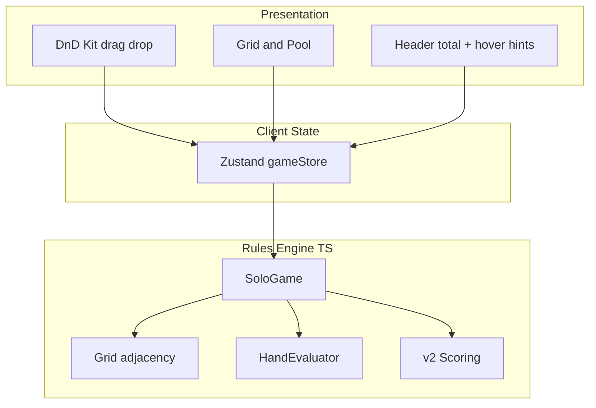

# Quintet Web PoC 技术设计

> **状态：PoC 已完成。** 可玩单人 solo 版本位于 [`poc/`](../poc/)，本文档描述其实现与设计决策；生产版 Web 应用为后续迭代。

## 1. 目标与范围

### 1.1 目标（PoC 已交付）

在浏览器中实现 Quintet **可玩 PoC**，支持：

- 从牌池 **拖拽** 卡牌到 5×5 牌阵
- 遵守邻接放置规则（首张任意，之后必须八方向相邻，含对角）
- **实时总分**：每次落子后更新（仅满 5 张的线路计入）
- 单人模式完整流程（开局 → 25 步 → 终局）
- 撤销、新局、操作计数、主题与明暗模式、线路 hover 提示、计分规则弹窗

### 1.2 PoC 范围外（后续迭代）

| 项 | 说明 |
|----|------|
| 双人 / 联机 | 参考 [`prototype/quintet/`](../prototype/quintet/) 双人 CLI；浏览器版 Phase 4+ |
| 后端 / 账号 | 纯前端，无服务器 |
| AI 对手 | Python 贪心 bot 已有；Web UI 未移植 |
| 12 线分项面板 | PoC 仅显示总分；hover 单格查看相关线路 |
| 移动端原生 | 响应式 Web；dnd-kit 支持触摸 |

### 1.3 参考实现

规则与计分以 Python 原型为准：

- 规则：[`prompt.md`](../prompt.md)
- 计分 v2：[`prototype/quintet/scoring.py`](../prototype/quintet/scoring.py)
- 可行性 / 分值说明：[`feasibility-analysis.zh.md`](feasibility-analysis.zh.md)、[`scoring-design.zh.md`](scoring-design.zh.md)

---

## 2. 技术选型

### 2.1 总览

| 层 | 选型 | 理由 |
|----|------|------|
| 语言 | **TypeScript** | 规则引擎需类型安全；与 React 生态一致 |
| 框架 | **React 18+** | 组件化 Grid / Pool；生态成熟 |
| 构建 | **Vite** | 快速 HMR，适合交互原型 |
| 拖拽 | **@dnd-kit/core** + **@dnd-kit/utilities** | 无障碍、触摸友好、可约束 drop 区域 |
| 状态 | **Zustand** | 轻量；游戏状态更新频繁但结构清晰 |
| 样式 | **CSS 变量** + 组件 CSS | Light/Dark；无 Tailwind |
| 测试 | **Vitest** | `engine/` 单测（13 cases） |

### 2.2 扑克牌 UI 库对比

Quintet 需要 52 张标准牌面 SVG、可缩放、MIT/CC0 友好许可证。

| 库 | 许可证 | 特点 | 建议 |
|----|--------|------|------|
| [@letele/playing-cards](https://www.npmjs.com/package/@letele/playing-cards) | CC0 | 基于 Adrian Kennard 经典 SVG；按需导入单牌；体量小 | **v1 首选** |
| [@yojda/react-playing-cards](https://www.npmjs.com/package/@yojda/react-playing-cards) | MIT | `suit`/`rank`/`width` props；4 种视觉 variant | 备选（需 Storybook 级定制时） |
| [@heruka_urgyen/react-playing-cards](https://www.npmjs.com/package/@heruka_urgyen/react-playing-cards) | MIT | 四色牌面、big-face；单 deck 分包可 tree-shake | 四色 / 无障碍友好场景 |

**推荐方案：** `@letele/playing-cards`

- 与规则一致的标准 52 张（无 Joker 亦可忽略 Joker 导出）
- CC0，无商用顾虑
- SVG 组件，`width`/`height` 随 Grid 单元格缩放

封装一层 `PlayingCard` 组件，统一 `{ rank, suit }` ↔ 库组件 的映射，便于日后更换 UI 库。

### 2.3 目录结构（已实现）

```
quinter/
  docs/
  prototype/
  poc/
    package.json
    vite.config.ts
    index.html
    themes/                 # 可插拔牌面主题
    src/
      main.tsx
      App.tsx
      index.css             # 主题变量、--cell-size
      engine/               # 纯 TS，无 React
        card.ts deck.ts grid.ts hand.ts
        scoring.ts game.ts state.ts
      store/
        gameStore.ts        # Zustand：对局、撤销、主题、明暗
      components/
        Board/              # 网格、drop、线路 hover 提示
        Pool/               # 可拖牌池
        Card/               # PlayingCard 适配层
        ScoringRules/       # 计分规则 dialog
      config/
        colorMode.ts
        scoringRules.ts     # v2 公式展示文案
```

**原则：** `engine/` 与 UI 分离；逻辑对照 Python 原型移植。

---

## 3. 架构

### 3.1 分层



### 3.2 数据流

1. **初始化：** `poolSize k` → shuffle deck → fill pool to k
2. **拖拽开始：** Pool 中卡牌 `DragOverlay` 跟随指针；非法落点灰显
3. **Drop 成功：** `game.play(poolIndex, row, col)` → 更新 grid / pool；若 pool 空则 refill
4. **计分刷新：** `scoreGridLive` — 满线计入总分；Stats 区显示 `liveScore.total`
5. **Hover 提示：** `getCellScoreHint` — 该格相关线路、**已形成**牌型与 v2 公式（不含补牌预测）
6. **终局：** 25 格满 → 禁用拖拽，底部 banner 显示最终分

### 3.3 实时计分策略

| 线路状态 | UI 行为 |
|----------|---------|
| 已放 0–4 张 | 不计入总分；hover 显示该线**当前已形成**牌型分（如对子、高牌） |
| 已放 5 张 | `evaluateFive` + `scoreV2`，计入总分 |
| 任一格 hover | 展示经过该格的行/列/对角线及公式 |

**PoC 实现：** 每次落子后 `scoreGridLive` 全量重算 12 线（O(12)，可忽略）。

**计分规则：** 左侧栏 **Scoring rules** 按钮打开 v2 公式表（[`config/scoringRules.ts`](../poc/src/config/scoringRules.ts)）。

---

## 4. 拖拽交互设计

### 4.1 交互模型

- **Drag source：** Pool 中的明牌（每张可拖一次，拖出后从 Pool 移除）
- **Drop target：** 空的 Grid 单元格
- **约束：**
  - 首枚：25 格均可 drop
  - 之后：仅 `legalPositions()` 返回的格子可 drop（dnd-kit `useDroppable` + 自定义 `disabled`）

### 4.2 反馈

| 状态 | 视觉 |
|------|------|
| 拖拽中 | 合法格：绿色描边；非法格：禁用光标 |
| 放置成功 | 短动画 snap + 音效（可选，v1 可省略） |
| 放置失败 | 卡牌弹回 Pool |

### 4.3 触控

dnd-kit 支持 pointer / touch；Grid 单元格最小点击区域建议 ≥ 44×44 px（含 responsive 缩放）。

---

## 5. 规则引擎移植

从 [`prototype/quintet/`](../prototype/quintet/) 映射到 `poc/src/engine/`：

| Python | TypeScript | 说明 |
|--------|------------|------|
| `card.py` | `card.ts` | `Rank`, `Suit`, `Card` |
| `deck.py` | `deck.ts` | shuffle (Fisher–Yates), draw |
| `grid.py` | `grid.ts` | 5×5, `legalPositions`, `place` |
| `hand.py` | `hand.ts` | Wheel, 10 categories |
| `scoring.py` | `scoring.ts` | `scoreV2` 公式逐行移植 |
| `game.py` | `game.ts` | `SoloGame` 状态机 |

**验证：** 选取 Python 单测中的固定 seed 对局，TS 引擎逐步断言 grid / score 一致。

**牌面字符串：** 内部统一 `rank + suit`（如 `As`, `Td`），与 `@letele/playing-cards` deck 键对齐。

---

## 6. UI 布局（已实现）

```
+------------------------------------------------------------------+
|  Quintet                              [Undo]  [New game]         |
+------------------------------------------------------------------+
| Options      |      [5×5 Grid]              |  Pool              |
| Pool k       |                              |  [cards]           |
| Theme        |                              |                    |
| Mode         |                              |                    |
| Stats        |                              |                    |
| Deck/Turn/   |                              |                    |
| Actions/Score|                              |                    |
| [Scoring     |                              |                    |
|  rules]      |                              |                    |
+------------------------------------------------------------------+
```

- 顶栏与下方游戏区等宽三列对齐（`sidebar | board | pool`）
- 牌阵居中；牌池牌与格子同尺寸（`--cell-size`）
- 总分在 Stats；无独立 12 线面板

---

## 7. 状态模型（Zustand sketch）

```typescript
interface GameStore {
  poolSize: number;
  state: SoloGameState;
  liveScore: ScoreSnapshot;
  history: SoloGameState[];   // undo，最多 25 步
  actionCount: number;
  themeId: CardThemeId;
  colorMode: "light" | "dark";
  initGame: (poolSize?: number) => void;
  dropCard: (poolIndex, row, col) => void;
  undo: () => void;
  setThemeId: (id) => void;
  setColorMode: (mode) => void;
}
```

撤销在每次成功 `dropCard` 前快照；`Ctrl+Z` / `Cmd+Z` 绑定于 App。

---

## 8. 测试策略

| 类型 | 范围 |
|------|------|
| 单元测试 | `engine/*` — 牌型、邻接、v2 计分、撤销、线路 hint |
| 对照测试 | 可选：与 Python 同 seed golden 对比（未入 CI） |
| E2E | 未实现 |

---

## 9. 实施阶段

| 阶段 | 交付 | 状态 |
|------|------|------|
| **W1** | 脚手架 + `engine/` 移植 + Vitest | ✅ |
| **W2** | Grid / Pool / PlayingCard + 5 主题 | ✅ |
| **W3** | dnd-kit 拖拽 + 邻接 + 落子 | ✅ |
| **W4** | 实时总分、撤销、布局、hover、计分规则、明暗模式 | ✅ |

PoC 版本 **`0.1.0`**（[`poc/package.json`](../poc/package.json)）。

---

## 10. 风险与对策

| 风险 | 对策 |
|------|------|
| TS / Python 计分漂移 | 共享 golden fixtures；CI 双端对照 |
| 卡牌库 API 变更 | `PlayingCard` 适配层隔离 |
| 拖拽在 Safari 异常 | dnd-kit 官方 touch 配置；真机抽测 |
| 12 线 UI 信息过载 | PoC 用 hover + 计分规则弹窗替代常驻面板 |

---

## 11. 结论

PoC 采用 **React + TypeScript + Vite + dnd-kit + Zustand**，牌面通过 **themes/** 插件化（含 @letele CC0 SVG）。`engine/` 自 Python 移植，UI 负责 solo 拖拽与 v2  live 总分。**PoC 目标已达成**；下一步可在此基础上扩展双人模式、分项计分面板、后端联机。

---

*文档版本 poc-1；[`poc/README.md`](../poc/README.md) 为运行与功能说明。*
